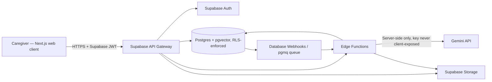
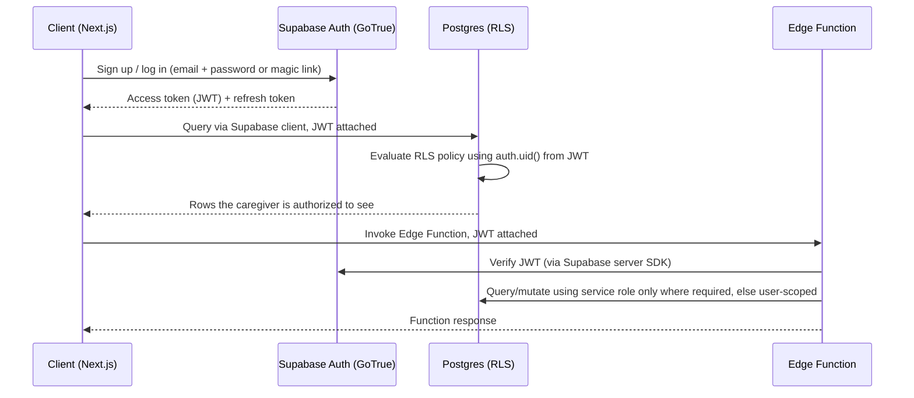
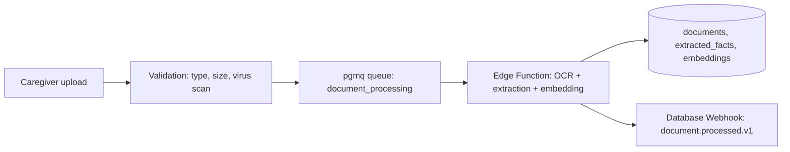
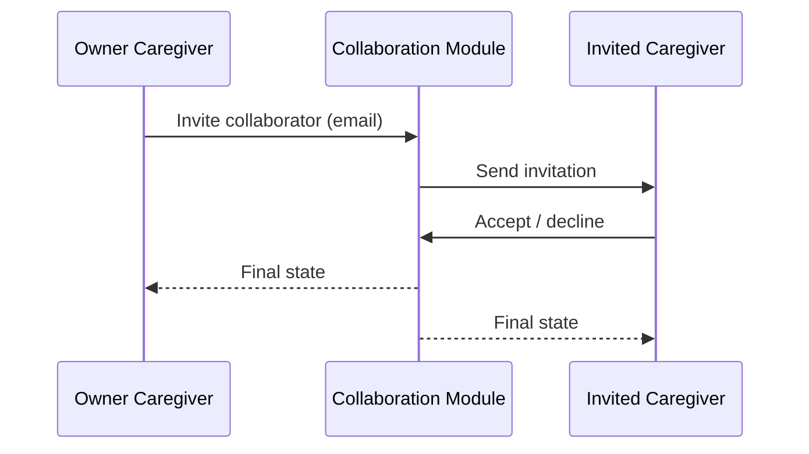
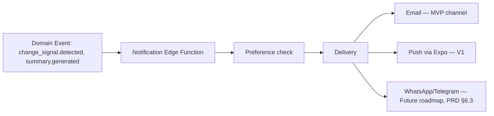
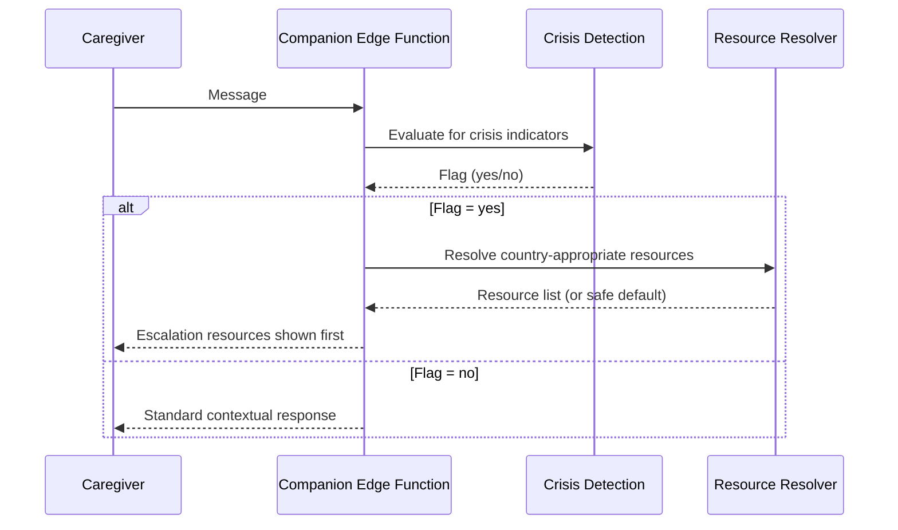
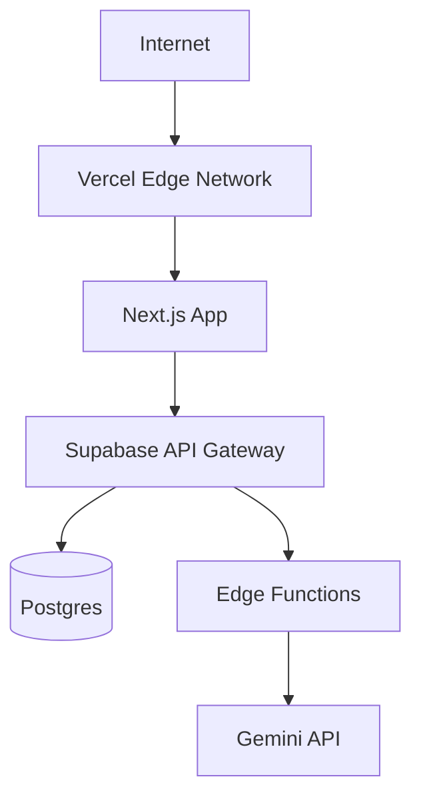

# SizoCare — Architecture Requirements Document Suite

> Companion to the PRD, Data and API Specifications, MVP AI Implementation Plan, and AI Agent Instructions. Several ARDs deviate from a generic microservice template because SizoCare's standardized technical baseline is Next.js + Expo/React Native + a dedicated Supabase project (Postgres, Auth, Storage, Edge Functions, Realtime), not a hand-rolled service mesh. Deviations are called out explicitly rather than silently reinterpreted, per DL-002 in the PRD.

## Document Control and System Context

| Field | Value |
|---|---|
| Document | Architecture Requirements Document Suite |
| System name | SizoCare |
| Target market | India (MVP) |
| Client platforms | Responsive web (Next.js) at MVP; Expo/React Native mobile at V1, sharing the same Supabase backend |
| Primary backend | Supabase (managed Postgres, Auth, Storage, Edge Functions, Realtime), one dedicated Supabase project for SizoCare |
| Data stack | PostgreSQL with `pgvector` (embeddings), Supabase Storage (documents), Supabase Realtime (presence/live updates) |
| Security model | Supabase Auth (JWT) + PostgreSQL Row Level Security (RLS) as the primary, database-enforced authorization boundary, with Edge Functions enforcing business rules RLS cannot express |
| Deployment | Vercel (Next.js) + Supabase-managed infrastructure; region selected for India data-residency preference |
| Version | 0.1 |
| Status | Draft — pending security and privacy review |
| Source PRD | SizoCare PRD v0.1 |

## Architecture Decision Conventions

- `MUST`: release-blocking requirement.
- `SHOULD`: preferred unless an ADR documents an approved exception.
- `MAY`: optional extension.
- Each decision includes rationale, trade-offs, ownership, and traceability back to the PRD.
- Diagrams show trust boundaries and data classifications, not merely boxes with arrows.

---

# ARD-1: System Context and Architecture Overview

## 1. Context and Architecture Topology

### System Context

SizoCare's client (Next.js web app, later an Expo/React Native app) talks only to Supabase-managed infrastructure and, indirectly through a server-side Edge Function, to the Gemini API. There is no separately hosted backend service tier: business logic that must not run on the client (AI orchestration, extraction, change detection, crisis evaluation) runs in Supabase Edge Functions, and data access control is enforced at the database layer through Row Level Security, not solely by application code.



### Trust Boundaries

| Boundary | Data entering | Data leaving | Authentication | Encryption | Failure mode |
|---|---|---|---|---|---|
| Client ↔ Supabase API Gateway | Caregiver input (case text, logs, chat messages) | Query results scoped by RLS | Supabase JWT (short-lived access token + refresh token) | TLS 1.2+ | Fail closed — invalid/expired JWT is rejected, not silently downgraded to anonymous access |
| Edge Function ↔ Gemini API | Retrieved, minimized case context + system policy | Model response text | Server-held API key (Supabase Function secret, never shipped to client) | TLS 1.2+ | Fail closed — provider error returns a safe "temporarily unavailable" state, never an unbounded local fallback |
| Client ↔ Supabase Storage | Uploaded documents | Signed, time-limited download URLs | Supabase JWT, bucket policy | TLS in transit, provider-managed encryption at rest (plus application-level envelope encryption for the most sensitive documents, see ARD-9) | Fail closed — upload rejected on auth/policy failure |
| Postgres RLS boundary | All row-level reads/writes | Rows visible to the requesting caregiver only | JWT claims (`auth.uid()`) evaluated per-query | N/A (in-process) | Fail closed — a missing or malformed policy denies access by default (`ENABLE ROW LEVEL SECURITY` with no permissive policy = deny) |

## 2. Core Service Boundaries

Because SizoCare runs on Supabase rather than a hand-rolled microservice mesh, "services" below are Edge Function modules plus their owned tables, not independently deployed processes.

| Service/domain | Primary responsibility | Owns | Must not own | Interfaces | Scaling unit |
|---|---|---|---|---|---|
| Account & Identity | Signup, session, onboarding state | `users` (Supabase-managed), `onboarding_state` | Case content | Supabase Auth API | Supabase-managed (serverless) |
| Case Profile | CareRecipient and CaseProfile CRUD, provenance | `care_recipients`, `case_facts` | Document storage internals, AI provider calls | REST via Edge Function `case-api` | Edge Function (serverless) |
| Document Intake | Upload, OCR, extraction, prompt-injection containment | `documents`, `extracted_facts` (pre-review) | Confirmed case facts (those move to Case Profile on confirmation) | Edge Function `document-api` | Edge Function (serverless) |
| Companion (RAG) | Prompt assembly, retrieval, Gemini invocation, boundary enforcement | Nothing persistent beyond `conversations`, `messages` | API keys client-side, raw provider credentials outside Function secrets | Edge Function `companion-api` | Edge Function (serverless) |
| Logging | Daily log CRUD | `daily_logs` | Symptom trend computation | Edge Function `log-api` | Edge Function (serverless) |
| Medication | Medication and adherence CRUD | `medications`, `medication_events` | Dosage guidance logic (explicitly out of scope) | Edge Function `medication-api` | Edge Function (serverless) |
| Change Detection | Scheduled baseline comparison, Change Signal generation | `change_signals` | Log entry authorship | Scheduled Edge Function (`pg_cron` trigger) | Scheduled job |
| Summary | Doctor-ready summary generation and versioning | `clinical_summaries` | Direct clinician access (no clinician account exists) | Edge Function `summary-api` | Edge Function (serverless) |
| Crisis | Crisis pattern detection, resource resolution | `risk_events` | Long-term case content | Invoked synchronously within Companion and Logging paths | In-process library + Edge Function |
| Billing (V1+) | Subscription state | `subscriptions` | Clinical data | Payment processor webhook receiver (Edge Function) | Edge Function (serverless) |

## 3. Architectural Principles

- Database-enforced authorization first: RLS is the authoritative deny-by-default boundary; Edge Functions add business rules RLS cannot express (e.g., "Companion cannot run without a confirmed non-clinical disclaimer"), they do not replace RLS.
- No client-side AI credentials, ever: the Gemini API key lives only in Supabase Function secrets and is used exclusively inside `companion-api` and `document-api`.
- One Supabase project per product: SizoCare's data is isolated from other products in the founder's portfolio at the infrastructure level, not merely by application-level tenancy.
- Backward-compatible schema evolution: all schema changes ship as versioned Supabase migrations; no destructive migration without an expand/migrate/contract sequence (ARD-5 §3, Data/API Spec §6).

---

# ARD-2: Identity, Authentication, Authorization, and Account Lifecycle

## 1. Identity Architecture

- Protocols: Supabase Auth (GoTrue) — email/password and magic-link at MVP; social OAuth providers deferred
- Identity providers: Supabase Auth only at MVP
- Access token TTL: 1 hour (Supabase default), refreshed transparently by the client SDK
- Refresh/session model: Supabase refresh-token rotation; refresh tokens stored in an HTTP-only cookie on web
- Device binding: None at MVP (single-device assumption not enforced; multiple concurrent sessions allowed)
- MFA/step-up authentication: Not required at MVP baseline; step-up email re-confirmation required for password reset
- Rate limiting and lockout: Supabase Auth built-in rate limits, supplemented by Edge Function-level throttling on sensitive routes (document upload, Companion calls)
- Eligibility/age/business verification: Self-attested 18+ and caregiver-relationship checkbox at signup; no third-party identity verification at MVP (flagged as PRD OQ-003-adjacent open question for jurisdictions requiring stronger verification)

## 2. Token Exchange and Session Verification Flow



## 3. Authorization Model

| Decision input | Source | Freshness | Deny condition |
|---|---|---|---|
| Actor identity | Supabase JWT `sub` claim | Per-request (token TTL 1h) | Missing/invalid/expired JWT |
| Role/scope | Single `owner` role at MVP; `collaborator` role added at V1 | Per-request | Actor is not the recorded owner (or an active collaborator, V1+) of the target CareRecipient |
| Consent | `consent_records` table (AI processing, document processing) | Checked at time of AI/document action | No active consent record of the required type |
| Resource state | `care_recipients.status`, `subscriptions.status` (V1+) | Per-request | Account suspended or deleted |

## 4. Account Lifecycle

- Registration: Supabase Auth signup → `onboarding_state` row created → non-clinical disclaimer acknowledgment required before Case Profile creation is unblocked
- Suspension: Founder-initiated only at MVP scale (no automated abuse-detection suspension yet); suspension sets `care_recipients.status = 'suspended'`, RLS denies all further reads/writes except account-recovery routes
- Export: Caregiver-initiated export job (Edge Function) assembles a structured export package per Data/API Spec §17
- Deletion: Caregiver-initiated deletion request → orchestrated deletion job across all owned tables and Storage objects, per Data/API Spec §16
- Recovery: Standard Supabase password-reset flow (email link)
- Session revocation: Supabase `signOut({ scope: 'global' })` on caregiver request or suspicious-activity response
- Audit evidence: Every lifecycle transition writes an `audit_events` row (actor, action, resource, result, timestamp)

---

# ARD-3: Core Domain Logic and Decision Engine

SizoCare has two core decision engines: the Companion's retrieval-and-response pipeline, and the Change Detection job. Both are deliberately simple and explainable for MVP (DL-004).

## 1. Domain Model

The Companion pipeline assembles a bounded prompt from layered context (safety policy, structured Case Profile, recent logs, medication context, relevant document excerpts, recent conversation turns, active Change Signals) and sends it to Gemini through the provider-abstraction interface. Change Detection is a scheduled comparison of an individual's recent logged values against their own historical baseline.

```text
Caregiver message -> input validation -> crisis pre-check -> context retrieval (RAG) -> prompt assembly -> Gemini call -> boundary-language post-check -> response
```

## 2. Algorithm or Rules

```pseudo
function assembleCompanionContext(careRecipientId, question, actorId):
    validate(actorId owns careRecipientId)          // RLS also enforces this independently
    if not hasActiveConsent(actorId, "ai_processing"):
        return DENY_NEEDS_CONSENT

    crisisFlag = evaluateCrisisPatterns(question)

    context = {
        systemPolicy: FIXED_SAFETY_POLICY,           // never caregiver-editable
        caseProfile: retrieveRelevantFacts(careRecipientId, question, limit=N),
        recentLogs: retrieveRecentLogs(careRecipientId, days=14),
        medicationContext: retrieveActiveMedications(careRecipientId),
        documentExcerpts: retrieveRelevantChunks(careRecipientId, question, limit=M),
        recentConversation: retrieveRecentTurns(conversationId, limit=K),
        activeSignals: retrieveActiveChangeSignals(careRecipientId)
    }

    prompt = buildPrompt(context, question)
    response = callGemini(prompt)                    // via provider-abstraction interface
    response = applyBoundaryPostCheck(response)       // strip/replace any dosage or diagnosis-asserting language that slips through

    if crisisFlag:
        response = prependCrisisResources(response, actorId.countryCode)

    return response

function evaluateChangeDetection(careRecipientId, category):
    recent = getLogValues(careRecipientId, category, trailingDays=14)
    baseline = getLogValues(careRecipientId, category, trailingDays=90, excludingRecent=True)
    if count(recent) < MIN_RECENT_POINTS or count(baseline) < MIN_BASELINE_POINTS:
        return NO_SIGNAL   // fail closed on insufficient data

    deviation = compare(recent, baseline)             // simple statistical deviation, not ML
    if deviation.exceedsThreshold:
        return ChangeSignal(category, deviation, recent, baseline)
    return NO_SIGNAL
```

## 3. Versioning and Reprocessing

- Model/rule version: the safety-policy prompt and the change-detection threshold configuration are both versioned artifacts (`policy_version`, `rule_version`) stored alongside every generated response/signal for auditability
- Backward compatibility: a policy or rule version change never retroactively rewrites past responses or signals; it only affects new evaluations
- Re-evaluation/reprocessing: Change Detection runs nightly via `pg_cron`-triggered Edge Function invocation, plus on-demand when a caregiver requests a summary
- Cooldown or rate constraints: Companion calls are rate-limited per caregiver (Data/API Spec §13) to control cost and abuse
- Explainability output: every Change Signal stores the compared periods, the data-point counts, and the deviation measure so the caregiver-facing explanation (PRD FR-CHANGE-002) can be generated deterministically from stored fields, not re-derived from the AI

---

# ARD-4: Client Architecture and Native Platform Integration

## 1. Shared Client Architecture

- Framework: Next.js (App Router)
- Language: TypeScript
- State management: React Query for server state; React Context/Zustand for local UI state
- Navigation: Next.js file-based routing
- Networking: Supabase JS client (typed against generated database types) for direct RLS-scoped queries; typed `fetch` wrappers for Edge Function calls
- Persistence: No dedicated local database at MVP; React Query cache only. Offline support is out of scope for MVP (PRD §9)
- Offline model: Read cached data when offline; block writes with a clear message (PRD §9)
- Analytics abstraction: A thin, privacy-safe event-tracking wrapper (ARD-13) so the underlying analytics tool can be swapped without touching call sites
- Accessibility: WCAG 2.1 AA

## 2. Platform Adapters

| Capability | Shared layer | iOS/native | Android/native | Backend authority |
|---|---|---|---|---|
| Authentication | Supabase JS/Expo SDK | Deferred to V1 (Expo SecureStore for token storage) | Deferred to V1 (Expo SecureStore) | Supabase Auth |
| Document capture | File picker (web) | Deferred to V1 (native camera/file picker via Expo) | Deferred to V1 | Document Intake Edge Function |
| Push notifications | Not in MVP (email only) | Deferred to V1 (Expo push) | Deferred to V1 (Expo push) | Notification module (ARD-11) |

> Assumption: MVP ships web-only. The Expo/React Native app is the V1 delivery vehicle, reusing the same Supabase backend, the same generated TypeScript types, and as much shared business logic (validation, formatting) as can be factored into a shared package. No native code is written in MVP.

## 3. Bridge/IPC Rules

- Mechanism: Not applicable in MVP (no native shell). For V1, Expo's typed native module bridge is the only sanctioned mechanism.
- Prohibited mechanisms: sockets, local HTTP servers, WebSockets for client-to-native communication, plaintext files — carried forward as a standing constraint for when native adapters are built.
- Sensitive data crossing rules: Auth tokens will move to Expo SecureStore at V1; no sensitive data is ever written to non-secure device storage.
- Native background execution: Not applicable at MVP.

---

# ARD-5: Data Architecture and Ownership

## 1. Data Classification

| Classification | Examples | Allowed systems | Encryption | Retention | Export/deletion |
|---|---|---|---|---|---|
| Restricted | Diagnosis, story narrative, document content, crisis event detail | Postgres (RLS-scoped), Storage, Edge Functions, Gemini (only the minimally retrieved excerpt, with consent) | Provider-managed at rest + application-level envelope encryption (ARD-9) for diagnosis and story fields | Until caregiver deletes or account is deleted | Included in export; hard-deleted on request |
| Sensitive | Daily logs, medication records, symptom observations | Postgres (RLS-scoped), Edge Functions | Provider-managed at rest | Until caregiver deletes or account is deleted | Included in export; hard-deleted on request |
| Private derived | Change Signals, AI-organized facts, extracted (unconfirmed) facts | Postgres (RLS-scoped) | Provider-managed at rest | Derived data expires if the source data is deleted | Included in export; deleted when source deleted |
| Public | None (SizoCare has no public-facing case content); marketing site content only | CDN/Next.js static | N/A | N/A | N/A |
| Aggregated analytics | Feature-usage counts, latency metrics | Analytics store (ARD-13) | Provider-managed at rest | 24 months, then aggregated further or dropped | Pseudonymous ref purged on account deletion |
| Ephemeral | Realtime presence/typing indicators | Supabase Realtime | In-transit only, not persisted | Session-lived | N/A |

## 2. Data Ownership

| Service | Owns | Reads through | Prohibited ownership | Source of truth |
|---|---|---|---|---|
| Case Profile module | `care_recipients`, `case_facts` | Companion, Summary (read-only via Edge Function) | Raw document files | Postgres |
| Document Intake module | `documents`, `extracted_facts` | Case Profile (on confirmation, moves data across) | Confirmed Case Profile facts | Postgres + Storage |
| Logging module | `daily_logs` | Symptom/Timeline, Change Detection, Summary | Medication data | Postgres |
| Medication module | `medications`, `medication_events` | Companion (boundary-checked), Summary | Dosage-recommendation logic (explicitly none) | Postgres |
| Change Detection module | `change_signals` | Summary, Timeline | Log authorship | Postgres |
| Summary module | `clinical_summaries` | — (terminal consumer) | Live log/medication data (reads a snapshot, does not own it) | Postgres |
| Crisis module | `risk_events` | Companion, Logging (writers) | Long-term case content | Postgres |

## 3. Storage Topology

| Store | Purpose | Consistency | Replication | Backup | RPO/RTO |
|---|---|---|---|---|---|
| Supabase Postgres (primary) | All relational/domain data, `pgvector` embeddings | Strong (single primary) | Supabase-managed standby | Automated daily backups (Supabase) + point-in-time recovery | RPO ≤ 24h (PITR reduces this further), RTO target ≤ 4h at MVP scale |
| Supabase Storage | Uploaded documents | Strong (single primary) | Supabase-managed | Included in Supabase backup posture | Same as above |
| `pgvector` index | Embedding similarity search for RAG retrieval | Co-located with primary Postgres | Same as Postgres | Same as Postgres | Same as Postgres |

---

# ARD-6: AI Context Retrieval and RAG Processing Pipeline

> Renamed from the generic "Domain Processing Pipeline" — this is SizoCare's main processing domain: turning uploaded documents and structured case data into retrievable, provenance-tagged context for the Companion.

## 1. Ingestion Architecture



## 2. Validation and Noise/Fraud Filtering

- File type and size validated server-side before queueing (FR-DOC-001)
- OCR confidence below a defined threshold routes the document to a "low-confidence extraction" state requiring more caregiver review, rather than silently trusting poor OCR output
- Extracted text is scanned for instruction-like patterns before being embedded or included in any prompt (FR-DOC-002); matches are logged, never executed
- Change Detection applies a minimum-data-point quarantine: signals are not generated below the configured threshold (ARD-3 §2)

## 3. Processing Algorithm

```pseudo
function processDocument(documentId):
    file = fetchFromStorage(documentId)
    if isImage(file):
        text = runOCR(file)
    else:
        text = extractText(file)

    text = sanitizeForPromptSafety(text)          // strip/flag instruction-like patterns, never execute them
    chunks = chunkText(text, maxTokens=CHUNK_SIZE)
    for chunk in chunks:
        embedding = embed(chunk)
        store(documents_chunks, chunk, embedding, provenance="document_extracted")

    candidateFacts = extractCandidateFacts(text)   // structured fact candidates, e.g. medication name, date
    for fact in candidateFacts:
        store(extracted_facts, fact, status="pending_review", provenance="document_extracted")

    emitEvent("document.processed.v1", documentId)
```

## 4. Output Contract

| Output | Consumer | Precision/sensitivity | TTL | Failure handling |
|---|---|---|---|---|
| `extracted_facts` (pending review) | Case Profile UI | Sensitive/Restricted | Until reviewed or document deleted | Extraction failure marks document `failed`, caregiver notified, retry offered |
| `document_chunks` embeddings | Companion retrieval | Restricted | Until document deleted | Missing embedding excludes the chunk from retrieval, does not error the whole response |
| `document.processed.v1` event | Case Profile module (review-queue update) | N/A (event, no payload PII beyond IDs) | N/A | At-least-once delivery, idempotent consumer |

---

# ARD-7: Caregiver–Care Recipient and Multi-Caregiver Collaboration Graph

> Renamed from the generic "Social/Collaboration/Relationship Graph." MVP has a single-owner relationship only (DL-003); this ARD documents the MVP model and the V1 collaboration design it must not foreclose.

## 1. Relationship Model

| Relationship | States | Creation rule | Revocation rule | Visibility effect |
|---|---|---|---|---|
| Caregiver ↔ CareRecipient (owner) | `active` | Created automatically at onboarding completion | Account deletion only (MVP has no transfer-of-ownership flow) | Owner sees all case data |
| Caregiver ↔ CareRecipient (collaborator, V1) | `invited` → `active` → `revoked` | Owner sends an invitation; invitee accepts | Owner revokes at any time | Collaborator sees shared notes only, per PRD OQ-004/OQ-011 (unresolved scope) |

## 2. Consent or Mutual-Approval Sequence (V1 design, not built in MVP)



## 3. Blocking, Removal, and Safety Enforcement

- Revoking a collaborator immediately updates the RLS policy predicate for that CareRecipient; because RLS is evaluated per-request against live table state, there is no cache to invalidate and no propagation delay beyond normal query latency.
- Propagation SLO: effectively immediate (next request), since authorization is not cached client-side or in a separate policy service.
- Non-restoration rule: a revoked collaborator does not regain access without a new invitation from the owner.

---

# ARD-8: Search, Discovery, and Indexing

> Scoped narrowly to RAG retrieval indexing — SizoCare has no general-purpose search/discovery surface across users; retrieval is always scoped to one caregiver's own CareRecipient.

## 1. Indexing Strategy

| Index | Source | Update method | Query pattern | Privacy filter |
|---|---|---|---|---|
| `case_facts_embeddings` | Confirmed CaseProfile facts | Synchronous on confirm/edit | Vector similarity + category filter | RLS: caregiver-owned CareRecipient only |
| `document_chunks_embeddings` | Extracted document text chunks | Async, on document processing | Vector similarity | RLS + provenance filter (confirmed-only for non-Companion consumers) |
| `logs_recency_index` | `daily_logs` | Synchronous on write (standard B-tree index on date/category) | Recency + category | RLS |

## 2. Search Pipeline

```text
Companion question -> auth (RLS via caregiver JWT) -> candidate retrieval (vector similarity over case_facts + document_chunks, plus recency-ranked logs) -> filtering (exclude pending-review facts) -> ranking (similarity + recency + category match) -> assembled context -> prompt
```

## 3. Ranking and Explainability

- Ranking factors: semantic similarity to the question, recency, category relevance to the question
- Prohibited factors: none based on any protected attribute; ranking never uses caregiver identity beyond scoping
- Personalisation: retrieval is inherently personalized (it is scoped to one CareRecipient's own data) — there is no cross-caregiver personalization
- Explanation: the assembled context list is retained per-response (admin/debug visibility only) to support the explainability requirement in ARD-3 §3
- Abuse resistance: query length limits, per-caregiver rate limits (Data/API Spec §13)

---

# ARD-9: Privacy Engineering and Cryptography

## 1. Privacy Enforcement

- Consent decision point: `document-api` and `companion-api` Edge Functions check `consent_records` before any AI-provider or document-processing call
- Default state: deny — no AI call proceeds without an active, unrevoked consent record
- Purpose limitation: retrieved context is used only to answer the caregiver's own question about their own CareRecipient; no cross-account use
- Minimisation: only retrieved, relevant context is sent to Gemini (ARD-3 §2), never the full case history by default
- Retention enforcement: scheduled deletion jobs enforce the retention table in Data/API Spec §15
- Export/deletion propagation: orchestrated job (ARD-2 §4) walks every owned table and Storage bucket

## 2. KMS and Envelope Encryption

```text
Plaintext (diagnosis, story narrative, document content) -> Data Encryption Key (per CareRecipient) -> Ciphertext, stored in Postgres/Storage
Data Encryption Key -> KMS Key Encryption Key (external KMS, e.g. cloud-provider KMS or Supabase Vault) -> Encrypted DEK, stored alongside ciphertext
```

| Data class | KMS key scope | Rotation | Access principals | Audit |
|---|---|---|---|---|
| Restricted (diagnosis, story, documents) | One Key Encryption Key per SizoCare environment (dev/staging/prod), one Data Encryption Key per CareRecipient | KEK rotated annually or on suspected compromise; DEK rotation is an open implementation question (see Appendix A ADR) | `document-api`, `case-api`, `summary-api` Edge Functions only | Every decrypt operation writes an `audit_events` row |
| Sensitive (logs, medication) | Provider-managed encryption at rest is the MVP baseline; application-level envelope encryption is a `SHOULD` for V1, not a hard MVP blocker | N/A at MVP | All Edge Functions with RLS-scoped access | Standard query audit only |

> Assumption, flagged for security review: application-level envelope encryption for Restricted data (diagnosis, story narrative, document content) is treated as a `MUST` before public (non-invite) launch, but MAY be deferred past the earliest internal-dogfood stage of MVP if the security reviewer accepts provider-managed encryption as an interim control. This is exactly the kind of exception the template requires an ADR for — see Appendix A.

## 3. Key and Secret Failure Modes

- KMS unavailable: encryption/decryption operations fail closed — the caller receives a safe error, never a plaintext fallback
- Rotation failure: alerts the founder/on-call; does not block existing reads (old KEK version remains valid until rotation completes)
- Suspected compromise: documented incident-response runbook (ARD-15) triggers key rotation and forced session revocation for affected accounts
- Recovery: KMS backup/recovery procedures follow the provider's documented disaster-recovery process; SizoCare does not implement a custom key-escrow mechanism at MVP

---

# ARD-10: Subscription and Billing Domain

> Renamed from the generic "Commercial, Venue, Content, or Transaction Domain."

## 1. Domain Architecture

Free, Paid, and (future) BYOK tiers as defined in PRD §11. Payment processor is not yet selected (candidate: a India-focused processor such as Razorpay, given the MVP market) — flagged as an open decision, not assumed.

## 2. Attribution, Anonymity, or Transaction Integrity

- Billing/subscription state is stored in a table separate from any clinical data table, enforcing the PRD §11 privacy constraint at the schema level, not only by convention
- Subscription events are append-only (`subscription_events`), giving a ledger of plan changes rather than only a current-state row
- Refund/reversal handling follows the selected payment processor's own dispute flow; SizoCare does not implement custom chargeback logic at MVP

## 3. Data Schema Summary

| Entity | Key fields | Owner | Sensitive fields | Lifecycle |
|---|---|---|---|---|
| `subscriptions` | `caregiver_id`, `tier`, `status`, `renews_at` | Billing module | Payment-method reference (tokenized by processor, never stored raw) | `trial`/`active` → `past_due` → `canceled` |

---

# ARD-11: Notifications and Real-Time Messaging

## 1. Notification Topology



## 2. Routing and Priority

| Notification | Trigger | Channel | Priority | Suppression | Deep link |
|---|---|---|---|---|---|
| Change Signal surfaced | `change_signal.detected.v1` | Email (MVP) | Normal | Caregiver can mute per category | Timeline, filtered to the signal's category |
| Summary generated | `summary.generated.v1` | Email (MVP) | Normal | None (always sent, low volume) | Summary draft |
| Crisis flag raised | `crisis.flagged.v1` | In-app only at MVP (no push channel yet); shown immediately in the active session | Highest | Never suppressed | Active conversation |

## 3. Delivery Guarantees

- Idempotency: notification dispatch keyed by `(event_id, channel)` to avoid duplicate sends on retry
- Retry: bounded retry (e.g., 3 attempts) with exponential backoff for email delivery failures
- Deduplication: same as idempotency key above
- User preferences: per-category mute settings stored per caregiver
- Quiet hours: not implemented at MVP (email is not time-sensitive enough to require it); revisit if push notifications ship in V1

---

# ARD-12: Crisis and Clinical-Boundary Safety Architecture

> Renamed from the generic "Trust, Safety, and Moderation" — SizoCare has no user-generated public content to moderate; its safety surface is crisis detection and clinical-boundary enforcement.

## 1. Case and Report Architecture

| Entity | Purpose | Access | Retention | Audit |
|---|---|---|---|---|
| `risk_events` | Record of a crisis-pattern flag (source, timestamp, country used for resources) | Owning caregiver only; founder for aggregate, privacy-preserving review | Same retention as the parent CareRecipient account | `audit_events` entry on every read by anyone other than the owning caregiver |
| `boundary_redirect_events` | Record of a declined/redirected Companion request (category only, not full content) | Owning caregiver; founder for aggregate review | Same as above | Same as above |

## 2. Safety Mode or Emergency Control Flow



## 3. Scoped Operator Access

- Active case required: not applicable at MVP — there is no internal trust-and-safety operator role with case-level access
- Purpose code required: N/A at MVP
- Time-limited access: N/A at MVP
- Field-level redaction: N/A at MVP (no operator access exists to redact for)
- Immutable audit: any future operator access (post-MVP) must write an immutable `audit_events` row before this ARD is considered satisfied for that access path

---

# ARD-13: Analytics and Telemetry

## 1. Privacy-Preserving Pipeline

```text
Client/Edge Function event -> validation (schema-checked) -> PII filter (structural, not content-based — events never carry free text) -> pseudonymous actor ref -> analytics store
```

## 2. Event Rules

- No raw case content, log content, message content, or document content in any analytics event.
- Schema registry: a shared TypeScript event-definition package, imported by both the Next.js client and Edge Functions, is the single source of truth for event shapes.
- Consent gating: an analytics opt-out (separate from AI-processing consent) is respected before any event is recorded.
- Sampling: none at MVP scale (event volume is low).
- k-anonymity or aggregation: product dashboards report on aggregates only; no dashboard displays single-caregiver event streams.
- Deletion handling: events are linked by a pseudonymous actor reference that is purged (or re-pseudonymized) on account deletion.

---

# ARD-14: Administration and Governance

## 1. Admin Access Architecture

- SSO/MFA: Founder/admin accounts require MFA (even though ordinary caregiver accounts do not at MVP)
- RBAC/ABAC: A single `admin` role at MVP, held only by the founder; no tiered internal team yet
- Just-in-time access: Not applicable at MVP scale
- Approval: Not applicable at MVP scale
- Session recording/audit: Supabase's own audit logging plus `audit_events` rows for any admin action touching caregiver data

## 2. Administrative Capabilities

| Capability | Role | Approval | Audit event | Kill switch |
|---|---|---|---|---|
| View aggregate metrics dashboard | Admin | None required | `admin.dashboard_viewed` | N/A |
| Toggle a feature flag | Admin | None required at MVP scale | `admin.flag_toggled` | The flag change itself is the kill switch |
| Access a caregiver's case content for support | Admin | Requires the caregiver's explicit, ticket-linked consent | `admin.case_access` (case ID, ticket ID, reason) | Access is time-boxed to the support ticket |

---

# ARD-15: Infrastructure, DevOps, and SRE

## 1. Deployment Topology

- Cloud/provider: Vercel (Next.js hosting) + Supabase (managed Postgres, Auth, Storage, Edge Functions)
- Region(s): Supabase region selected for proximity to India and data-residency preference (exact region confirmed during Phase 0 setup)
- Availability zones: Supabase-managed (provider default for the selected region/tier)
- Orchestration: None self-managed — both Vercel and Supabase are managed platforms at MVP scale
- Infrastructure as code: Supabase CLI-managed migrations checked into the repository; Vercel project configuration as code where supported
- Deployment packaging: Git-based deploys (Vercel) and `supabase db push`/migration pipeline in CI
- Network segmentation: Provider-managed; Edge Functions are the only components holding the Gemini API key
- Edge/WAF: Vercel's edge network and Supabase's platform-level protections at MVP; a dedicated WAF is a later-phase consideration



## 2. SLOs and Performance

| Capability | SLI | Target | Window | Alert threshold |
|---|---|---:|---|---:|
| Companion response | Latency (p95) | ≤ 6s | Rolling 24h | > 8s sustained 15 min |
| Case/Log API | Latency (p95) | ≤ 500ms | Rolling 24h | > 1s sustained 15 min |
| Platform availability | Uptime | ≥ 99.5% at MVP scale | Monthly | Any Supabase/Vercel incident affecting SizoCare |

## 3. Resilience and Recovery

- RPO: ≤ 24 hours baseline (Supabase point-in-time recovery reduces this in practice)
- RTO: ≤ 4 hours at MVP scale
- Backup testing: Quarterly restore drill against a staging Supabase project
- Failover testing: Deferred until traffic justifies a multi-region posture
- Degraded mode: If Gemini is unavailable, Companion shows a clear unavailability state; logging, medication, and case-profile features remain fully functional (they do not depend on the AI provider)
- Rollback: Vercel instant rollback to a prior deployment; database migrations follow expand/migrate/contract so a code rollback never leaves the schema in an incompatible state

---

# ARD-16: Quality Assurance and Verification

## 1. Test Automation Matrix

| Layer | Scope | Tools | Required coverage | Release gate |
|---|---|---|---:|---|
| Unit | Business logic in Edge Functions and shared TS packages | Vitest/Jest | Core modules ≥ 80% | Yes |
| Contract | Edge Function request/response shapes | Generated types + schema validation tests | All public routes | Yes |
| Integration | RLS policy behaviour, cross-table flows | Supabase local dev + test harness | All authorization-sensitive paths | Yes |
| End-to-end | Onboarding → Companion → Log → Summary happy paths | Playwright | Core user journeys (PRD §8) | Yes |
| Security | Dependency scanning, secret scanning | `npm audit`/Dependabot, secret scanner in CI | All merges | Yes |
| Safety/boundary | Companion boundary-language checks (§7.4 PRD) | Curated adversarial prompt test suite, manually reviewed | 100% of release-blocking boundary categories | Yes, release-blocking |
| Performance | Companion and API latency under representative load | k6 or equivalent | MVP-scale target load | Should (not release-blocking for a small invite-only beta) |

## 2. Verification Invariants

1. No Companion response in the adversarial test suite recommends a medication dosage change, re-diagnoses, or normalizes covert medication.
2. Every RLS policy denies access by default when no explicit permissive policy matches (verified by an integration test that asserts cross-caregiver data is never visible).
3. A crisis-flagged response always renders escalation resources before any other content, verified across the full country-resource configuration set.

## 3. Release Evidence

- [ ] Architecture decisions approved
- [ ] Threat model updated (PRD §10.1)
- [ ] Contract compatibility verified
- [ ] Privacy invariants tested (Data/API Spec §22)
- [ ] Security controls tested
- [ ] SLO/load targets met
- [ ] Disaster recovery tested
- [ ] Operational runbooks approved

---

# Appendix A: Architecture Decision Records

## ADR-001: Use PostgreSQL Row Level Security as the primary authorization boundary instead of a hand-rolled internal-API authorization layer

- Status: Accepted
- Date: 2026-09-22
- Owners: Founder
- Related requirements: ARD-2 §3, ARD-5 §2, PRD §10

### Context

The generic Architecture Requirements template assumes an internal-API authorization model with gRPC/mTLS between independently deployed services. SizoCare's standardized stack is Supabase, where most data access happens directly from the client against Postgres, mediated by RLS, rather than through a hand-rolled internal service tier.

### Decision

RLS policies are the authoritative, database-enforced authorization boundary for all direct table access. Edge Functions add business rules that RLS cannot express (e.g., consent gating before an AI call) but do not duplicate RLS's row-scoping logic.

### Alternatives Considered

| Alternative | Advantages | Disadvantages | Rejection reason |
|---|---|---|---|
| Hand-rolled internal API with application-level authorization for every read | Matches the generic template exactly | Significant additional engineering effort with no clear benefit at MVP scale; duplicates what RLS already does well | Not justified for a solo/small-team MVP build |
| Client-side-only authorization (trust the client to only request its own data) | Simplest to build | Not fail-closed; a compromised or modified client could read other caregivers' data | Unacceptable given the sensitivity of the data (PRD §10) |

### Consequences

- Positive: Less custom authorization code to maintain and audit; authorization logic lives in one place (SQL policies) that can be tested directly.
- Negative: Engineers must understand RLS well; a missing policy is a silent-deny (safe) but an *overly permissive* policy is a silent security hole that unit tests must specifically probe for.
- Operational: RLS policies are part of the versioned migration history, not a separately deployed configuration.
- Security/privacy: Strengthens the fail-closed posture required by PRD product principles.

### Validation

ARD-16 §2 invariant 2, verified by an integration test suite that attempts cross-caregiver reads and asserts they are denied.

## ADR-002: Application-level envelope encryption for Restricted data is a MUST before public launch, MAY be deferred during internal dogfooding

- Status: Proposed — pending security reviewer sign-off
- Date: 2026-09-22
- Owners: Founder, Security Reviewer (to be engaged)
- Related requirements: ARD-9 §2, PRD §10.2

### Context

Provider-managed encryption at rest (Supabase's default) is a reasonable baseline but does not protect Restricted data (diagnosis, story narrative, document content) against a compromised database credential in the same way application-level envelope encryption would.

### Decision

Treat application-level envelope encryption for Restricted fields as release-blocking for any public (non-invite) launch, but allow the earliest internal-dogfooding stage (founder's own family, PRD §13.1) to proceed on provider-managed encryption alone while the envelope-encryption implementation is built, subject to explicit security-reviewer sign-off on the interim risk.

### Alternatives Considered

| Alternative | Advantages | Disadvantages | Rejection reason |
|---|---|---|---|
| Require envelope encryption before any code runs, including internal dogfooding | Maximally conservative | Blocks the founder's own early validation unnecessarily, given the founder is both the developer and the initial user/data subject's family | Disproportionate for the internal-only stage |
| Never implement application-level envelope encryption, rely on provider encryption only | Simplest | Weaker defense-in-depth for the most sensitive data class in the product | Inconsistent with the "provenance and safety first" product principle |

### Consequences

- Positive: Balances early validation speed against the sensitivity of the data.
- Negative: Requires explicit tracking to ensure the deferral does not quietly become permanent.
- Operational: Envelope-encryption implementation becomes a named, tracked Phase 0/1 task in the MVP AI Implementation Plan.
- Security/privacy: Residual risk during the internal-only stage is accepted explicitly, not by omission.

### Validation

Security reviewer sign-off recorded before the beta cohort (PRD §13.1, stage 2) is invited; release gate in PRD §13.2.
