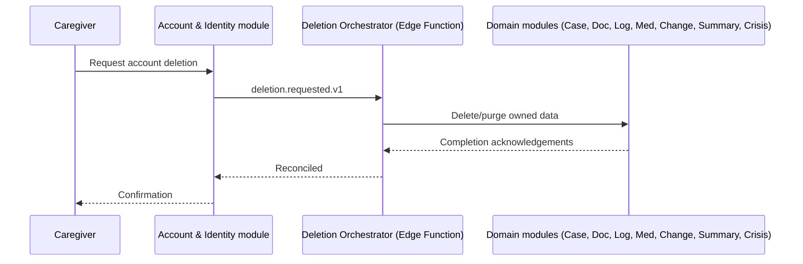

# SizoCare — Data and API Specifications

> Normative implementation contract. RFC 2119 terms (MUST/SHOULD/MAY) are used consistently. Every endpoint, schema, event, and error is testable and versioned. Read alongside the Architecture Requirements Document (ARD), especially ARD-1, ARD-2, ARD-5, and ADR-001 — SizoCare's transport and authorization model deviates from a generic gRPC/mTLS microservice mesh because the platform is Supabase (Postgres + RLS + Edge Functions), not a hand-rolled service tier. That deviation is documented here rather than silently reinterpreted.

## Document Control

| Field | Value |
|---|---|
| Document | Data and API Specifications |
| System | SizoCare |
| Version | 0.1 |
| Status | Draft — pending security and privacy review |
| Target market | India (MVP) |
| Platforms | Responsive web (Next.js) at MVP; Expo/React Native at V1 |
| API style | Public REST (via Supabase Edge Functions) + direct RLS-scoped Postgres access from the client; internal calls over authenticated HTTPS between Edge Functions; async events via Supabase Database Webhooks and `pgmq` queues |
| Primary stores | Supabase Postgres (with `pgvector`), Supabase Storage |
| Security | Supabase Auth JWT (Bearer) + PostgreSQL Row Level Security + TLS 1.2+ everywhere |
| Source documents | SizoCare PRD v0.1, SizoCare ARD v0.1 |

# 1. Purpose

This document defines:

- Canonical entities and data ownership
- Relational and vector (`pgvector`) schemas
- Public client APIs (Edge Functions + direct RLS-scoped table access)
- Internal Edge-Function-to-Edge-Function contracts
- Asynchronous event contracts
- Authentication, authorization, consent, privacy, safety, and compliance controls
- Validation, idempotency, pagination, versioning, errors, and rate limits
- Retention, deletion, export, audit, and observability
- Example requests and responses
- Testable acceptance criteria

# 2. API Design Principles

## 2.1 External API

- Base URL: `https://<project-ref>.supabase.co/functions/v1/` for Edge Function routes; direct table access via the Supabase client SDK is scoped by RLS and does not use a REST base path in the traditional sense
- Protocol: HTTPS/1.1+ (TLS 1.2 minimum)
- Authentication: `Authorization: Bearer <Supabase JWT>` on every request
- Versioning: Path-based (`/v1/...`) for Edge Function routes; database schema changes are versioned via migrations, not URL path
- Mutation idempotency: `Idempotency-Key` header required on all state-changing Edge Function calls (document upload confirmation, Companion message send, medication event, summary generation)
- Timestamp standard: RFC 3339, UTC
- Identifier format: UUID v4 for all primary keys
- Sensitive-data boundary: Edge Functions never log request/response bodies for Restricted or Sensitive classified data (ARD-5 §1); only structured, redacted metadata is logged
- Backward compatibility: Additive changes only within a `v1` path; breaking changes require a new path version and a documented deprecation window

## 2.2 Internal API

> Deviation from the generic gRPC/mTLS template, per ADR-001: SizoCare's internal calls are Edge-Function-to-Edge-Function HTTPS invocations authenticated with a Supabase service-role JWT, not a separate service mesh. The contracts in §10 are still specified in a protobuf-like interface-definition style because it is a precise, language-agnostic way to describe the shape of these calls — the actual wire format is JSON over HTTPS.

- Protocol: HTTPS, JSON payloads, interface shape defined in protobuf-style IDL for precision (§10)
- Transport security: TLS 1.2+ (Supabase-managed); no separate mTLS layer at MVP scale
- Service identity: Supabase service-role JWT, scoped to the calling Edge Function's deployment
- Purpose code: Required on any internal call that reads Restricted data (e.g., Change Detection reading raw logs) — logged in `audit_events`
- Case/approval context: Not applicable at MVP (no internal case-management workflow)
- Compatibility window: Internal contracts version alongside the Edge Function deployment; no long-lived multi-version support is required since all Edge Functions deploy from the same repository

## 2.3 Asynchronous Events

> Deviation from the generic Kafka/SQS/NATS template, per ADR-001's spirit: the event broker is Postgres itself, via the `pgmq` extension (a Postgres-native message queue) for work queues and Supabase Database Webhooks for fan-out notifications to Edge Functions. This keeps all asynchronous processing inside the single dedicated Supabase project (DL-002).

- Broker: `pgmq` (Postgres message queue extension) for internal work queues; Supabase Database Webhooks for triggering Edge Functions on row changes
- Events are immutable once written to their queue/log table
- Consumers are idempotent (keyed by `event_id`)
- Duplicate and out-of-order delivery must be tolerated (at-least-once delivery)
- PII policy: event payloads carry entity IDs and classification-safe metadata only, never Restricted/Sensitive field values
- Schema registry: a shared TypeScript package defines every event payload type, imported by both event producers and consumers
- Dead-letter policy: after 5 failed processing attempts, a message moves to a `*_dlq` table for manual/founder review, and an alert fires

# 3. Global Conventions

## 3.1 Identifier Format

```text
UUID v4, e.g. 5c1f6e2a-3b4d-4e9a-8f21-0a6c5d9e7b1f
```

## 3.2 Common Headers

| Header | Required | Description |
|---|---:|---|
| `Authorization` | Yes | `Bearer <Supabase JWT>` |
| `X-Request-ID` | Recommended | Client-generated trace ID, propagated into logs |
| `Idempotency-Key` | Mutations | Unique key retained for 24 hours |
| `X-Client-Version` | Yes | Semantic client version (Next.js app build) |
| `X-Platform` | Yes | `web` \| `ios` \| `android` (the latter two from V1) |
| `X-Device-ID` | No | Not collected at MVP (no device-binding requirement, ARD-2 §1) |
| `Accept-Language` | Yes | `en-IN` at MVP; additional locales as Phase 3 roadmap ships |
| `If-Match` | Conditional | Optimistic concurrency for mutable resources (Case Facts, Medications) |

## 3.3 Standard Response Envelope

Success:

```json
{
  "data": {},
  "meta": {
    "request_id": "5c1f6e2a-3b4d-4e9a-8f21-0a6c5d9e7b1f",
    "timestamp": "2026-09-22T10:15:00Z"
  }
}
```

List:

```json
{
  "data": [],
  "meta": {
    "request_id": "5c1f6e2a-3b4d-4e9a-8f21-0a6c5d9e7b1f",
    "timestamp": "2026-09-22T10:15:00Z",
    "next_cursor": "eyJpZCI6ICIuLi4ifQ==",
    "has_more": true
  }
}
```

Error:

```json
{
  "error": {
    "code": "COMPANION_CONSENT_REQUIRED",
    "message": "AI processing consent is required before Companion can respond.",
    "details": {},
    "retryable": false
  },
  "meta": {
    "request_id": "5c1f6e2a-3b4d-4e9a-8f21-0a6c5d9e7b1f",
    "timestamp": "2026-09-22T10:15:00Z"
  }
}
```

## 3.4 Pagination

- Model: cursor-based
- Default limit: 20
- Maximum limit: 100
- Cursor TTL: 24 hours
- Stable sort key: `(created_at, id)` composite
- Offset pagination allowed only for: nothing at MVP (cursor-based only, to avoid unstable ordering on frequently-appended tables like `daily_logs`)

## 3.5 Optimistic Concurrency

- Mutable resources (Case Facts, Medications, Clinical Summaries) return an `ETag`
- Updates include `If-Match`
- Conflict status: `409 Conflict`
- Error code: `RESOURCE_VERSION_CONFLICT`

## 3.6 Idempotency

| Field | Description |
|---|---|
| Key | Client-generated UUID, sent as `Idempotency-Key` |
| Actor | Authenticated caregiver (`auth.uid()`) |
| Route | Canonical Edge Function route |
| Request hash | SHA-256 of the normalized request body |
| Stored response | Full response body + status, stored in `idempotency_keys` |
| TTL | 24 hours |

Reusing a key with a different body returns `IDEMPOTENCY_KEY_REUSED`.

# 4. Data Classification

| Classification | Examples | Allowed systems | Encryption | Default retention |
|---|---|---|---|---|
| Restricted | Diagnosis, story narrative, document content, crisis event detail | Postgres (RLS), Storage, Edge Functions, Gemini (minimal retrieved excerpt, consent-gated) | Provider-managed at rest + application-level envelope encryption (ARD-9, ADR-002) | Until caregiver deletion; account deletion cascades |
| Sensitive | Daily logs, medication records, symptom observations | Postgres (RLS), Edge Functions | Provider-managed at rest | Until caregiver deletion; account deletion cascades |
| Private derived | Change Signals, AI-organized facts, pending extracted facts | Postgres (RLS) | Provider-managed at rest | Expires with source data |
| Public | Marketing site content only | CDN/Next.js static | N/A | N/A |
| Moderation restricted | `risk_events`, `boundary_redirect_events` | Postgres (RLS), founder aggregate review only | Provider-managed at rest | Same as parent account; never shared externally without legal basis |
| Aggregated analytics | Feature-usage counts, latency | Analytics store (ARD-13) | Provider-managed at rest | 24 months |
| Ephemeral | Realtime presence/typing indicators | Supabase Realtime | In-transit only | Session-lived, not persisted |

# 5. Service Data Ownership

| Service | Owns | Must not own | Reads through | Emits |
|---|---|---|---|---|
| Case Profile | `care_recipients`, `case_facts` | Raw document files | `case-api` | `case_fact.confirmed.v1` |
| Document Intake | `documents`, `extracted_facts` | Confirmed case facts | `document-api` | `document.processed.v1` |
| Companion | `conversations`, `messages` | Case Profile source-of-truth data (reads via retrieval, does not own) | `companion-api` | `companion.message_sent.v1` |
| Logging | `daily_logs` | Medication data | `log-api` | `log.created.v1` |
| Medication | `medications`, `medication_events` | Dosage-recommendation logic (none exists) | `medication-api` | `medication_event.recorded.v1` |
| Change Detection | `change_signals` | Log authorship | Scheduled job | `change_signal.detected.v1` |
| Summary | `clinical_summaries` | Live log/medication data | `summary-api` | `summary.generated.v1` |
| Crisis | `risk_events`, `boundary_redirect_events` | Long-term case content | In-process + `crisis-api` | `crisis.flagged.v1` |

Services modify only owned data. Cross-service changes occur through APIs or events.

# 6. Canonical Data Model

> Consolidation note: to keep the schema implementable by a small team, the brief's `CaseProfile`, `StoryEntry`, and `ExtractedFact` entities are modeled as one `case_facts` table distinguished by `fact_type` and `provenance` columns, rather than three separate tables. `SymptomObservation` is modeled as a category/value pair on `daily_logs` rather than a separate table, since every symptom observation is a daily log entry. `SideEffectObservation` is a nullable field on `medication_events`. This is flagged here, in the PRD manifest, and in ARD-5 rather than silently diverging from the brief's entity list.

## 6.1 CareRecipient

### Purpose

The person receiving care. Never a SizoCare account holder in MVP (PRD DL-003).

### Ownership

- Owner: Case Profile module
- Classification: Restricted (name, diagnosis fields)
- Source of truth: Postgres
- Retention: Until the owning caregiver's account is deleted

### Schema

```sql
CREATE TABLE care_recipients (
    id UUID PRIMARY KEY DEFAULT gen_random_uuid(),
    owner_caregiver_id UUID NOT NULL REFERENCES auth.users(id),
    preferred_name TEXT NOT NULL,
    relationship_to_caregiver TEXT NOT NULL,
    age_band TEXT NOT NULL,
    diagnosis_summary TEXT,               -- envelope-encrypted (ARD-9)
    status TEXT NOT NULL CHECK (status IN ('active', 'suspended', 'deleted')),
    created_at TIMESTAMPTZ NOT NULL DEFAULT now(),
    updated_at TIMESTAMPTZ NOT NULL DEFAULT now(),
    deleted_at TIMESTAMPTZ,
    version INTEGER NOT NULL DEFAULT 1
);
ALTER TABLE care_recipients ENABLE ROW LEVEL SECURITY;
```

### Constraints and Indexes

```sql
CREATE INDEX idx_care_recipients_owner ON care_recipients (owner_caregiver_id);
CREATE POLICY care_recipients_owner_rw ON care_recipients
    FOR ALL USING (owner_caregiver_id = auth.uid());
```

### Field Rules

| Field | Type | Required | Classification | Validation | Mutable |
|---|---|---:|---|---|---:|
| `preferred_name` | TEXT | Yes | Restricted | 1–100 chars | Yes |
| `diagnosis_summary` | TEXT | No | Restricted | Free text, caregiver/document-sourced only | Yes |
| `status` | TEXT | Yes | Internal | Enum | Yes (system-controlled transitions) |

### Lifecycle

```text
active -> suspended -> active (reinstated) | deleted (terminal)
```

### Deletion and Export

- Export representation: `care_recipient.json` in the export package (§17)
- Soft delete: `status = 'deleted'`, `deleted_at` set immediately on request
- Hard delete: Row and all dependent rows purged within the reconciliation SLO (§16)
- Cascade/event: Triggers `deletion.requested.v1` orchestration across all owning services

## 6.2 CaseFact

### Purpose

A single provenance-tagged fact about the care recipient — narrative, structured field, or AI-organized interpretation.

### Ownership

- Owner: Case Profile module
- Classification: Restricted
- Source of truth: Postgres (`pgvector` embedding co-located for retrieval)
- Retention: Until deleted by caregiver or account deletion

### Schema

```sql
CREATE TABLE case_facts (
    id UUID PRIMARY KEY DEFAULT gen_random_uuid(),
    care_recipient_id UUID NOT NULL REFERENCES care_recipients(id),
    fact_type TEXT NOT NULL,              -- 'story_narrative' | 'structured_field' | 'document_extracted' | 'ai_organized'
    fact_category TEXT NOT NULL,          -- e.g. 'background','trigger','treatment_history','stressor'
    content TEXT NOT NULL,                -- envelope-encrypted (ARD-9)
    provenance TEXT NOT NULL CHECK (provenance IN ('caregiver_reported','patient_reported','document_extracted','ai_organized')),
    source_document_id UUID REFERENCES documents(id),
    status TEXT NOT NULL CHECK (status IN ('pending_review','active','superseded','deleted')),
    embedding VECTOR(768),
    created_at TIMESTAMPTZ NOT NULL DEFAULT now(),
    updated_at TIMESTAMPTZ NOT NULL DEFAULT now(),
    deleted_at TIMESTAMPTZ,
    version INTEGER NOT NULL DEFAULT 1
);
ALTER TABLE case_facts ENABLE ROW LEVEL SECURITY;
```

### Constraints and Indexes

```sql
CREATE INDEX idx_case_facts_recipient ON case_facts (care_recipient_id, status);
CREATE INDEX idx_case_facts_embedding ON case_facts USING ivfflat (embedding vector_cosine_ops);
CREATE POLICY case_facts_owner_rw ON case_facts
    FOR ALL USING (care_recipient_id IN (SELECT id FROM care_recipients WHERE owner_caregiver_id = auth.uid()));
```

### Field Rules

| Field | Type | Required | Classification | Validation | Mutable |
|---|---|---:|---|---|---:|
| `provenance` | TEXT | Yes | Internal | Enum, never client-overridable after creation for `document_extracted`/`ai_organized` | No (provenance itself is immutable once set) |
| `status` | TEXT | Yes | Internal | Enum, `pending_review` only valid for `document_extracted` | Yes |
| `content` | TEXT | Yes | Restricted | Story narratives: non-empty with no product-level character limit. Other fact types: 1–4000 chars. | Yes (creates a new version, prior retained per PRD FR-CASE-002 BR2) |

### Lifecycle

```text
pending_review -> active -> superseded (on edit, prior version audit-retained) -> deleted
```

### Deletion and Export

- Export representation: `case_facts.json`
- Soft delete: `status = 'deleted'`, content nulled, an audit stub retained (fact existed, category, timestamps) per PRD FR-CASE §Business Rule 2
- Hard delete: On account deletion only
- Cascade/event: `case_fact.confirmed.v1` on `pending_review → active`

## 6.3 UploadedDocument

### Purpose

A document uploaded by the caregiver as source material for the Case Profile.

### Ownership

- Owner: Document Intake module
- Classification: Restricted
- Source of truth: Postgres (metadata) + Supabase Storage (file)
- Retention: Until caregiver deletes the document or the account

### Schema

```sql
CREATE TABLE documents (
    id UUID PRIMARY KEY DEFAULT gen_random_uuid(),
    care_recipient_id UUID NOT NULL REFERENCES care_recipients(id),
    storage_path TEXT NOT NULL,
    file_type TEXT NOT NULL CHECK (file_type IN ('pdf','docx','jpg','png')),
    size_bytes INTEGER NOT NULL CHECK (size_bytes > 0 AND size_bytes <= 26214400),
    ai_processing_consent_id UUID NOT NULL REFERENCES consent_records(id),
    status TEXT NOT NULL CHECK (status IN ('uploading','processing','extracted','reviewed','failed','deleted')),
    ocr_confidence NUMERIC(4,3),
    created_at TIMESTAMPTZ NOT NULL DEFAULT now(),
    updated_at TIMESTAMPTZ NOT NULL DEFAULT now(),
    deleted_at TIMESTAMPTZ,
    version INTEGER NOT NULL DEFAULT 1
);
ALTER TABLE documents ENABLE ROW LEVEL SECURITY;
```

### Constraints and Indexes

```sql
CREATE INDEX idx_documents_recipient ON documents (care_recipient_id, status);
CREATE POLICY documents_owner_rw ON documents
    FOR ALL USING (care_recipient_id IN (SELECT id FROM care_recipients WHERE owner_caregiver_id = auth.uid()));
```

### Field Rules

| Field | Type | Required | Classification | Validation | Mutable |
|---|---|---:|---|---|---:|
| `file_type` | TEXT | Yes | Internal | Enum | No |
| `size_bytes` | INTEGER | Yes | Internal | ≤ 25 MB | No |
| `ai_processing_consent_id` | UUID | Yes | Internal | Must reference an unrevoked consent record | No |

### Lifecycle

```text
uploading -> processing -> extracted -> reviewed
processing -> failed (retry offered)
```

### Deletion and Export

- Export representation: Original file included under `attachments/` in the export package
- Soft delete: `status = 'deleted'`, Storage object scheduled for hard deletion
- Hard delete: File purged from Storage within the reconciliation SLO
- Cascade/event: Deleting a document cascades to its not-yet-confirmed `extracted_facts`/`case_facts` (pending_review only)

## 6.4 Conversation

### Purpose

A Companion chat thread.

### Ownership

- Owner: Companion module
- Classification: Restricted
- Source of truth: Postgres
- Retention: Until deleted by caregiver or account deletion

### Schema

```sql
CREATE TABLE conversations (
    id UUID PRIMARY KEY DEFAULT gen_random_uuid(),
    care_recipient_id UUID NOT NULL REFERENCES care_recipients(id),
    caregiver_id UUID NOT NULL REFERENCES auth.users(id),
    title TEXT,
    policy_version TEXT NOT NULL,
    status TEXT NOT NULL CHECK (status IN ('active','archived','deleted')),
    created_at TIMESTAMPTZ NOT NULL DEFAULT now(),
    updated_at TIMESTAMPTZ NOT NULL DEFAULT now(),
    deleted_at TIMESTAMPTZ,
    version INTEGER NOT NULL DEFAULT 1
);
ALTER TABLE conversations ENABLE ROW LEVEL SECURITY;
```

### Constraints and Indexes

```sql
CREATE INDEX idx_conversations_caregiver ON conversations (caregiver_id, updated_at DESC);
CREATE POLICY conversations_owner_rw ON conversations
    FOR ALL USING (caregiver_id = auth.uid());
```

### Field Rules

| Field | Type | Required | Classification | Validation | Mutable |
|---|---|---:|---|---|---:|
| `policy_version` | TEXT | Yes | Internal | Must match a known deployed safety-policy version | No |

### Lifecycle

```text
active -> archived -> deleted
```

### Deletion and Export

- Export representation: `conversations.json` + `messages.json`
- Soft delete: `status = 'deleted'`
- Hard delete: On account deletion
- Cascade/event: Deletes dependent `messages` rows

## 6.5 Message

### Purpose

A single turn in a Companion conversation (caregiver or assistant).

### Ownership

- Owner: Companion module
- Classification: Restricted
- Source of truth: Postgres
- Retention: With parent Conversation

### Schema

```sql
CREATE TABLE messages (
    id UUID PRIMARY KEY DEFAULT gen_random_uuid(),
    conversation_id UUID NOT NULL REFERENCES conversations(id),
    role TEXT NOT NULL CHECK (role IN ('caregiver','assistant')),
    content TEXT NOT NULL,                -- envelope-encrypted (ARD-9)
    crisis_flagged BOOLEAN NOT NULL DEFAULT false,
    boundary_redirect_category TEXT,
    created_at TIMESTAMPTZ NOT NULL DEFAULT now()
);
ALTER TABLE messages ENABLE ROW LEVEL SECURITY;
```

### Constraints and Indexes

```sql
CREATE INDEX idx_messages_conversation ON messages (conversation_id, created_at);
CREATE POLICY messages_owner_rw ON messages
    FOR ALL USING (conversation_id IN (SELECT id FROM conversations WHERE caregiver_id = auth.uid()));
```

### Field Rules

| Field | Type | Required | Classification | Validation | Mutable |
|---|---|---:|---|---|---:|
| `content` | TEXT | Yes | Restricted | 1–8000 chars | No (messages are append-only) |
| `crisis_flagged` | BOOLEAN | Yes | Internal | — | No |

### Lifecycle

```text
created (terminal — messages are immutable once written)
```

### Deletion and Export

- Export representation: `messages.json`
- Soft delete: Not applicable to individual messages; deletion happens at the Conversation level
- Hard delete: On account/conversation deletion
- Cascade/event: None

## 6.6 DailyLog

### Purpose

A structured daily observation entry (covers the brief's `DailyLog` and `SymptomObservation`).

### Ownership

- Owner: Logging module
- Classification: Sensitive
- Source of truth: Postgres
- Retention: Until deleted by caregiver or account deletion

### Schema

```sql
CREATE TABLE daily_logs (
    id UUID PRIMARY KEY DEFAULT gen_random_uuid(),
    care_recipient_id UUID NOT NULL REFERENCES care_recipients(id),
    author_caregiver_id UUID NOT NULL REFERENCES auth.users(id),
    category TEXT NOT NULL,               -- fixed taxonomy: mood, sleep, appetite, social_interaction, agitation,
                                           -- suspiciousness, unusual_belief, hallucination_related, medication_adherence,
                                           -- self_care, daily_functioning, notable_incident, appointment, caregiver_note
    intensity_rating SMALLINT CHECK (intensity_rating BETWEEN 1 AND 5),
    free_text TEXT,
    observed_at TIMESTAMPTZ NOT NULL,
    created_at TIMESTAMPTZ NOT NULL DEFAULT now(),
    edited_at TIMESTAMPTZ,
    status TEXT NOT NULL CHECK (status IN ('active','edited','deleted')) DEFAULT 'active',
    version INTEGER NOT NULL DEFAULT 1
);
ALTER TABLE daily_logs ENABLE ROW LEVEL SECURITY;
```

### Constraints and Indexes

```sql
CREATE INDEX idx_daily_logs_recipient_category ON daily_logs (care_recipient_id, category, observed_at DESC);
CREATE POLICY daily_logs_owner_rw ON daily_logs
    FOR ALL USING (care_recipient_id IN (SELECT id FROM care_recipients WHERE owner_caregiver_id = auth.uid()));
```

### Field Rules

| Field | Type | Required | Classification | Validation | Mutable |
|---|---|---:|---|---|---:|
| `category` | TEXT | Yes | Internal | Must be in the fixed taxonomy | No |
| `observed_at` | TIMESTAMPTZ | Yes | Sensitive | Must not be in the future (PRD FR-LOG error case) | Yes |
| `free_text` | TEXT | No | Sensitive | ≤ 2000 chars | Yes (edit retains history table `daily_log_history`) |

### Lifecycle

```text
active -> edited (prior version copied to daily_log_history) -> deleted
```

### Deletion and Export

- Export representation: `daily_logs.json`
- Soft delete: `status = 'deleted'`
- Hard delete: On account deletion
- Cascade/event: `log.created.v1` on insert; feeds Change Detection and Summary

## 6.7 Medication

### Purpose

A medication record as entered by the caregiver.

### Ownership

- Owner: Medication module
- Classification: Sensitive
- Source of truth: Postgres

### Schema

```sql
CREATE TABLE medications (
    id UUID PRIMARY KEY DEFAULT gen_random_uuid(),
    care_recipient_id UUID NOT NULL REFERENCES care_recipients(id),
    name TEXT NOT NULL,
    caregiver_entered_schedule TEXT NOT NULL,
    start_date DATE NOT NULL,
    status TEXT NOT NULL CHECK (status IN ('active','discontinued')) DEFAULT 'active',
    discontinued_at TIMESTAMPTZ,
    created_at TIMESTAMPTZ NOT NULL DEFAULT now(),
    updated_at TIMESTAMPTZ NOT NULL DEFAULT now(),
    version INTEGER NOT NULL DEFAULT 1
);
ALTER TABLE medications ENABLE ROW LEVEL SECURITY;
```

### Constraints and Indexes

```sql
CREATE INDEX idx_medications_recipient ON medications (care_recipient_id, status);
CREATE POLICY medications_owner_rw ON medications
    FOR ALL USING (care_recipient_id IN (SELECT id FROM care_recipients WHERE owner_caregiver_id = auth.uid()));
```

### Field Rules

| Field | Type | Required | Classification | Validation | Mutable |
|---|---|---:|---|---|---:|
| `name` | TEXT | Yes | Sensitive | 1–200 chars | Yes |
| `status` | TEXT | Yes | Internal | Enum | Yes |

### Lifecycle

```text
active -> discontinued
```

### Deletion and Export

- Export representation: `medications.json`
- Soft delete: Retained (medication history is clinically meaningful); no hard delete except on account deletion
- Cascade/event: None beyond `medication_events`

## 6.8 MedicationEvent

### Purpose

A single dose record (covers the brief's `MedicationEvent` and `SideEffectObservation`).

### Ownership

- Owner: Medication module
- Classification: Sensitive

### Schema

```sql
CREATE TABLE medication_events (
    id UUID PRIMARY KEY DEFAULT gen_random_uuid(),
    medication_id UUID NOT NULL REFERENCES medications(id),
    status TEXT NOT NULL CHECK (status IN ('taken','missed','unknown')),
    side_effect_note TEXT,
    occurred_at TIMESTAMPTZ NOT NULL,
    logged_after_discontinuation BOOLEAN NOT NULL DEFAULT false,
    created_at TIMESTAMPTZ NOT NULL DEFAULT now()
);
ALTER TABLE medication_events ENABLE ROW LEVEL SECURITY;
```

### Constraints and Indexes

```sql
CREATE INDEX idx_med_events_medication ON medication_events (medication_id, occurred_at DESC);
CREATE POLICY medication_events_owner_rw ON medication_events
    FOR ALL USING (medication_id IN (
        SELECT m.id FROM medications m JOIN care_recipients c ON c.id = m.care_recipient_id
        WHERE c.owner_caregiver_id = auth.uid()
    ));
```

### Field Rules

| Field | Type | Required | Classification | Validation | Mutable |
|---|---|---:|---|---|---:|
| `status` | TEXT | Yes | Sensitive | Enum | No (append-only) |
| `side_effect_note` | TEXT | No | Sensitive | ≤ 1000 chars | No |

### Lifecycle

```text
created (terminal — append-only)
```

### Deletion and Export

- Export representation: `medication_events.json`
- Hard delete: Only on account deletion
- Cascade/event: `medication_event.recorded.v1` on insert

## 6.9 ChangeSignal

### Purpose

A caregiver-reviewable output of the Change Detection job.

### Ownership

- Owner: Change Detection module
- Classification: Private derived

### Schema

```sql
CREATE TABLE change_signals (
    id UUID PRIMARY KEY DEFAULT gen_random_uuid(),
    care_recipient_id UUID NOT NULL REFERENCES care_recipients(id),
    category TEXT NOT NULL,
    direction TEXT NOT NULL CHECK (direction IN ('increase','decrease')),
    recent_period_start DATE NOT NULL,
    recent_period_end DATE NOT NULL,
    baseline_period_start DATE NOT NULL,
    baseline_period_end DATE NOT NULL,
    recent_data_point_count INTEGER NOT NULL,
    baseline_data_point_count INTEGER NOT NULL,
    rule_version TEXT NOT NULL,
    status TEXT NOT NULL CHECK (status IN ('surfaced','acknowledged','dismissed')) DEFAULT 'surfaced',
    created_at TIMESTAMPTZ NOT NULL DEFAULT now()
);
ALTER TABLE change_signals ENABLE ROW LEVEL SECURITY;
```

### Constraints and Indexes

```sql
CREATE INDEX idx_change_signals_recipient ON change_signals (care_recipient_id, status, created_at DESC);
CREATE POLICY change_signals_owner_rw ON change_signals
    FOR ALL USING (care_recipient_id IN (SELECT id FROM care_recipients WHERE owner_caregiver_id = auth.uid()));
```

### Field Rules

| Field | Type | Required | Classification | Validation | Mutable |
|---|---|---:|---|---|---:|
| `recent_data_point_count` | INTEGER | Yes | Internal | ≥ configured minimum (ARD-3) | No |
| `status` | TEXT | Yes | Internal | Enum | Yes (`surfaced → acknowledged/dismissed`) |

### Lifecycle

```text
surfaced -> acknowledged | dismissed
```

### Deletion and Export

- Export representation: `change_signals.json`
- Soft delete: Never independently deleted by caregiver (dismissal ≠ deletion, per PRD FR-CHANGE BR2); purged on account deletion
- Cascade/event: `change_signal.detected.v1` on insert

## 6.10 ClinicalSummary

### Purpose

A doctor-ready summary document.

### Ownership

- Owner: Summary module
- Classification: Restricted

### Schema

```sql
CREATE TABLE clinical_summaries (
    id UUID PRIMARY KEY DEFAULT gen_random_uuid(),
    care_recipient_id UUID NOT NULL REFERENCES care_recipients(id),
    period_start DATE NOT NULL,
    period_end DATE NOT NULL,
    content JSONB NOT NULL,               -- structured sections, each tagged with a source (caregiver|ai_organized)
    status TEXT NOT NULL CHECK (status IN ('generating','draft','edited','approved')) DEFAULT 'generating',
    superseded_by UUID REFERENCES clinical_summaries(id),
    created_at TIMESTAMPTZ NOT NULL DEFAULT now(),
    updated_at TIMESTAMPTZ NOT NULL DEFAULT now(),
    version INTEGER NOT NULL DEFAULT 1
);
ALTER TABLE clinical_summaries ENABLE ROW LEVEL SECURITY;
```

### Constraints and Indexes

```sql
CREATE INDEX idx_summaries_recipient ON clinical_summaries (care_recipient_id, created_at DESC);
CREATE POLICY summaries_owner_rw ON clinical_summaries
    FOR ALL USING (care_recipient_id IN (SELECT id FROM care_recipients WHERE owner_caregiver_id = auth.uid()));
```

### Field Rules

| Field | Type | Required | Classification | Validation | Mutable |
|---|---|---:|---|---|---:|
| `content` | JSONB | Yes | Restricted | Must validate against the summary section schema (§9.1 example) | Yes (creates a new version on regeneration, prior retained via `superseded_by`) |
| `status` | TEXT | Yes | Internal | Enum | Yes |

### Lifecycle

```text
generating -> draft -> edited -> approved
```

### Deletion and Export

- Export representation: `clinical_summaries.json`
- Soft delete: Retained unless caregiver explicitly deletes; purged on account deletion
- Cascade/event: `summary.generated.v1`

## 6.11 RiskEvent

### Purpose

A record of a crisis-pattern flag.

### Ownership

- Owner: Crisis module
- Classification: Moderation restricted

### Schema

```sql
CREATE TABLE risk_events (
    id UUID PRIMARY KEY DEFAULT gen_random_uuid(),
    care_recipient_id UUID NOT NULL REFERENCES care_recipients(id),
    source TEXT NOT NULL CHECK (source IN ('companion','log')),
    country_code TEXT,
    false_positive_reported BOOLEAN,
    created_at TIMESTAMPTZ NOT NULL DEFAULT now()
);
ALTER TABLE risk_events ENABLE ROW LEVEL SECURITY;
```

### Constraints and Indexes

```sql
CREATE INDEX idx_risk_events_recipient ON risk_events (care_recipient_id, created_at DESC);
CREATE POLICY risk_events_owner_r ON risk_events
    FOR SELECT USING (care_recipient_id IN (SELECT id FROM care_recipients WHERE owner_caregiver_id = auth.uid()));
```

### Field Rules

| Field | Type | Required | Classification | Validation | Mutable |
|---|---|---:|---|---|---:|
| `source` | TEXT | Yes | Internal | Enum | No |
| `country_code` | TEXT | No | Internal | ISO 3166-1 alpha-2 | No |

### Lifecycle

```text
created (terminal)
```

### Deletion and Export

- Export representation: `risk_events.json` (metadata only, no message content)
- Hard delete: Only on account deletion
- Cascade/event: `crisis.flagged.v1` on insert

## 6.12 ConsentRecord

### Purpose

A record of caregiver consent for a specific data-processing purpose (AI processing, document processing, analytics).

### Ownership

- Owner: Account & Identity module
- Classification: Internal (governs access to Restricted data, not itself Restricted content)

### Schema

```sql
CREATE TABLE consent_records (
    id UUID PRIMARY KEY DEFAULT gen_random_uuid(),
    caregiver_id UUID NOT NULL REFERENCES auth.users(id),
    consent_type TEXT NOT NULL CHECK (consent_type IN ('ai_processing','document_ai_processing','analytics')),
    granted_at TIMESTAMPTZ NOT NULL DEFAULT now(),
    revoked_at TIMESTAMPTZ,
    version INTEGER NOT NULL DEFAULT 1
);
ALTER TABLE consent_records ENABLE ROW LEVEL SECURITY;
```

### Constraints and Indexes

```sql
CREATE UNIQUE INDEX idx_consent_active ON consent_records (caregiver_id, consent_type) WHERE revoked_at IS NULL;
CREATE POLICY consent_records_owner_rw ON consent_records
    FOR ALL USING (caregiver_id = auth.uid());
```

### Field Rules

| Field | Type | Required | Classification | Validation | Mutable |
|---|---|---:|---|---|---:|
| `consent_type` | TEXT | Yes | Internal | Enum | No |
| `revoked_at` | TIMESTAMPTZ | No | Internal | Must be null or ≥ `granted_at` | Yes (set once, on revocation) |

### Lifecycle

```text
granted -> revoked
```

### Deletion and Export

- Export representation: `consent_records.json`
- Hard delete: Only on account deletion (retained until then as compliance evidence)
- Cascade/event: Revocation immediately blocks any dependent AI/document-processing call (ARD-9 §1)

## 6.13 AuditEvent

### Purpose

An immutable audit trail entry for lifecycle transitions and any access to Restricted data outside the normal caregiver-owner path.

### Ownership

- Owner: Platform-wide (written by every module)
- Classification: Internal

### Schema

```sql
CREATE TABLE audit_events (
    id UUID PRIMARY KEY DEFAULT gen_random_uuid(),
    occurred_at TIMESTAMPTZ NOT NULL DEFAULT now(),
    actor_ref UUID NOT NULL,
    action TEXT NOT NULL,
    resource_ref TEXT NOT NULL,
    purpose_code TEXT,
    result TEXT NOT NULL CHECK (result IN ('allow','deny','success','failure')),
    metadata JSONB
);
```

### Constraints and Indexes

```sql
CREATE INDEX idx_audit_events_actor ON audit_events (actor_ref, occurred_at DESC);
-- No RLS SELECT policy for ordinary caregivers; audit_events is admin/service-role read-only.
```

### Field Rules

| Field | Type | Required | Classification | Validation | Mutable |
|---|---|---:|---|---|---:|
| `action` | TEXT | Yes | Internal | Non-empty | No |
| `result` | TEXT | Yes | Internal | Enum | No |

### Lifecycle

```text
created (terminal — immutable)
```

### Deletion and Export

- Export representation: Not included in caregiver export (internal control record); may be summarized for a legal/compliance export if required
- Hard delete: Never deleted except under a documented legal-hold-expired process
- Cascade/event: None (this table is itself the audit trail for other cascades)

# 7. Cache and Ephemeral Data Model

| Key pattern | Value | TTL | Writer | Reader | Privacy rule |
|---|---|---:|---|---|---|
| `idempotency:{caregiver_id}:{key}` | Stored response + status | 24h | Any Edge Function | Same Edge Function | Never logged in plaintext beyond the stored response itself |
| `realtime:presence:{care_recipient_id}` | Collaborator presence (V1+) | Session-lived | Supabase Realtime | Collaborators on the same CareRecipient | No content, presence only |

# 8. Analytics Event Schema

## 8.1 Product Event Envelope

```json
{
  "event_id": "3f9c1b2a-...",
  "event_name": "companion.message_sent",
  "schema_version": "1",
  "occurred_at": "2026-09-22T10:15:00Z",
  "actor_ref": "pseudonymous-ref-...",
  "session_ref": "session-...",
  "source": "web_client",
  "properties": {}
}
```

## 8.2 Required Events

| Event | Trigger | Required properties | Forbidden properties | Consumer |
|---|---|---|---|---|
| `auth.signup_completed` | Signup + disclaimer ack | `signup_method`, `onboarding_path_chosen` | email, phone, case content | Product analytics |
| `case.fact_confirmed` | Caregiver confirms a pending fact | `fact_category`, `provenance` | fact content, diagnosis text | Product analytics |
| `companion.message_sent` | Caregiver sends a message | `message_length_bucket`, `response_latency_ms`, `boundary_redirect_triggered` | message content, response content | Product analytics, reliability dashboard |
| `log.entry_created` | Log saved | `categories_used`, `has_free_text` | free-text content | Product analytics |
| `change.signal_surfaced` | Signal created | `category`, `direction`, `data_point_count` | raw log values | Product analytics |
| `crisis.flag_raised` | Crisis pattern match | `source`, `country_code_bucket` | message/log content | Safety review (aggregate only) |

# 9. Public API Specification

## 9.1 Companion

### POST `/v1/companion/conversations/{conversation_id}/messages`

#### Purpose

Send a caregiver message to the Companion and receive a safety-bounded, context-grounded response.

#### Authentication and Authorization

- Authentication: Required
- Required scopes/roles: `owner` of the CareRecipient linked to the conversation
- Consent/policy checks: Active `ai_processing` consent required; non-clinical disclaimer acknowledgment required for the session
- Resource ownership: `conversations.caregiver_id = auth.uid()`

#### Headers

| Header | Required | Value/rule |
|---|---:|---|
| `Idempotency-Key` | Yes | Required — prevents duplicate sends on client retry |
| `If-Match` | No | Not applicable (messages are append-only) |

#### Path Parameters

| Parameter | Type | Required | Validation |
|---|---|---:|---|
| `conversation_id` | UUID | Yes | Must exist and be owned by caller |

#### Request

```json
{
  "content": "She said the neighbors are watching her again today. How should I respond?"
}
```

#### Validation

- `content` is 1–8000 characters
- Rejects if the CareRecipient has no minimum Case Profile content (PRD FR-AUTH BR2)

#### Success Response

- Status: `201 Created`
```json
{
  "data": {
    "id": "9a2e...",
    "role": "assistant",
    "content": "...",
    "crisis_flagged": false,
    "boundary_redirect_category": null
  },
  "meta": {
    "request_id": "...",
    "timestamp": "2026-09-22T10:15:03Z"
  }
}
```

#### Errors

| HTTP | Code | Condition | Retryable |
|---:|---|---|---:|
| 400 | `VALIDATION_ERROR` | Content empty or over length limit | No |
| 401 | `UNAUTHENTICATED` | Missing/invalid session | No |
| 403 | `FORBIDDEN` | Caller does not own the conversation | No |
| 409 | `COMPANION_CONSENT_REQUIRED` | No active AI-processing consent | No |
| 422 | `CASE_PROFILE_INCOMPLETE` | Minimum case content not present | No |
| 429 | `RATE_LIMITED` | Companion rate limit exceeded | Yes |
| 502 | `PROVIDER_UNAVAILABLE` | Gemini API error/timeout | Yes |

#### Side Effects

- Database: Inserts a `caregiver` message row, then an `assistant` message row
- Events: `companion.message_sent.v1`; `crisis.flagged.v1` if triggered
- Notifications: None (in-app only)
- Audit: `audit_events` entry if a boundary redirect occurred

#### Idempotency and Concurrency

Duplicate sends with the same `Idempotency-Key` return the original stored response rather than generating a second Gemini call.

#### Acceptance Criteria

- Given a valid message and sufficient Case Profile content, when sent, then a 201 response contains an assistant message with `crisis_flagged` correctly set.
- Given the CareRecipient has no Case Profile content yet, when a message is sent, then the API returns `422 CASE_PROFILE_INCOMPLETE` rather than calling Gemini.

## 9.2 Case Profile

### POST `/v1/care-recipients/{care_recipient_id}/case-facts`

#### Purpose

Create a caregiver-authored Case Fact.

#### Authentication and Authorization

- Authentication: Required
- Required scopes/roles: `owner`
- Consent/policy checks: None required for caregiver-authored text (consent applies to AI/document processing, not to storing the caregiver's own words)
- Resource ownership: `care_recipients.owner_caregiver_id = auth.uid()`

#### Headers

| Header | Required | Value/rule |
|---|---:|---|
| `Idempotency-Key` | Yes | Required |

#### Path Parameters

| Parameter | Type | Required | Validation |
|---|---|---:|---|
| `care_recipient_id` | UUID | Yes | Must be owned by caller |

#### Request

```json
{
  "fact_type": "story_narrative",
  "fact_category": "background",
  "content": "..."
}
```

#### Validation

- `content` 1–4000 characters
- `fact_type` restricted to `story_narrative` or `structured_field` for this endpoint (document-derived facts are created by the Document Intake pipeline, not this route)

#### Success Response

- Status: `201 Created`
```json
{
  "data": { "id": "...", "status": "active", "provenance": "caregiver_reported" },
  "meta": { "request_id": "...", "timestamp": "2026-09-22T10:15:00Z" }
}
```

#### Errors

| HTTP | Code | Condition | Retryable |
|---:|---|---|---:|
| 400 | `VALIDATION_ERROR` | Bad `fact_type`/length | No |
| 401 | `UNAUTHENTICATED` | — | No |
| 403 | `FORBIDDEN` | Not the owner | No |
| 404 | `NOT_FOUND` | CareRecipient not found/not visible | No |
| 429 | `RATE_LIMITED` | — | Yes |

#### Side Effects

- Database: Inserts `case_facts` row, `provenance = 'caregiver_reported'`, `status = 'active'`, computes and stores `embedding`
- Events: None (embedding generation is synchronous for caregiver-authored text)
- Audit: None (routine write)

#### Idempotency and Concurrency

Standard idempotency key behaviour (§3.6).

#### Acceptance Criteria

- Given valid input, when created, then the fact is immediately available to Companion retrieval (no pending-review step for caregiver-authored text).

## 9.3 Documents

### POST `/v1/care-recipients/{care_recipient_id}/documents`

#### Purpose

Register an uploaded document (file already placed in Storage via a signed upload URL) and enqueue it for processing.

#### Authentication and Authorization

- Authentication: Required
- Required scopes/roles: `owner`
- Consent/policy checks: Requires an active `document_ai_processing` consent record; the request is rejected otherwise
- Resource ownership: `care_recipients.owner_caregiver_id = auth.uid()`

#### Headers

| Header | Required | Value/rule |
|---|---:|---|
| `Idempotency-Key` | Yes | Required |

#### Path Parameters

| Parameter | Type | Required | Validation |
|---|---|---:|---|
| `care_recipient_id` | UUID | Yes | Must be owned by caller |

#### Request

```json
{
  "storage_path": "documents/5c1f.../discharge-summary.pdf",
  "file_type": "pdf",
  "size_bytes": 812345,
  "consent_id": "..."
}
```

#### Validation

- `file_type` in `{pdf, docx, jpg, png}`
- `size_bytes` ≤ 25 MB
- `consent_id` references an unrevoked `document_ai_processing` consent

#### Success Response

- Status: `202 Accepted`
```json
{
  "data": { "id": "...", "status": "processing" },
  "meta": { "request_id": "...", "timestamp": "2026-09-22T10:15:00Z" }
}
```

#### Errors

| HTTP | Code | Condition | Retryable |
|---:|---|---|---:|
| 400 | `VALIDATION_ERROR` | Bad type/size | No |
| 401 | `UNAUTHENTICATED` | — | No |
| 403 | `FORBIDDEN` | Not the owner | No |
| 409 | `DOCUMENT_CONSENT_REQUIRED` | No active consent | No |
| 429 | `RATE_LIMITED` | Upload-rate limit exceeded | Yes |

#### Side Effects

- Database: Inserts `documents` row, `status = 'processing'`
- Events: Enqueues to `pgmq` `document_processing` queue
- Audit: None (routine write; audit occurs on any later admin access)

#### Idempotency and Concurrency

Standard idempotency key behaviour.

#### Acceptance Criteria

- Given a valid registration request with active consent, when submitted, then the document enters `processing` and a `document.processed.v1` event eventually fires (async).

## 9.4 Daily Logs

### POST `/v1/care-recipients/{care_recipient_id}/logs`

#### Purpose

Create a daily log entry.

#### Authentication and Authorization

- Authentication: Required
- Required scopes/roles: `owner`
- Resource ownership: `care_recipients.owner_caregiver_id = auth.uid()`

#### Headers

| Header | Required | Value/rule |
|---|---:|---|
| `Idempotency-Key` | Yes | Required |

#### Request

```json
{
  "category": "mood",
  "intensity_rating": 2,
  "free_text": null,
  "observed_at": "2026-09-21T20:00:00Z"
}
```

#### Validation

- `category` must be in the fixed taxonomy (§6.6)
- `observed_at` must not be in the future

#### Success Response

- Status: `201 Created`
```json
{
  "data": { "id": "...", "status": "active" },
  "meta": { "request_id": "...", "timestamp": "2026-09-22T10:15:00Z" }
}
```

#### Errors

| HTTP | Code | Condition | Retryable |
|---:|---|---|---:|
| 400 | `VALIDATION_ERROR` | Bad category or future `observed_at` | No |
| 401 | `UNAUTHENTICATED` | — | No |
| 403 | `FORBIDDEN` | Not the owner | No |
| 429 | `RATE_LIMITED` | — | Yes |

#### Side Effects

- Database: Inserts `daily_logs` row
- Events: `log.created.v1`
- Audit: None

#### Idempotency and Concurrency

Standard idempotency key behaviour.

#### Acceptance Criteria

- Given a valid log, when created, then it appears in the Timeline immediately and is eligible input for the next Change Detection run.

## 9.5 Medication Events

### POST `/v1/care-recipients/{care_recipient_id}/medications/{medication_id}/events`

#### Purpose

Record a medication dose status.

#### Authentication and Authorization

- Authentication: Required
- Required scopes/roles: `owner`
- Resource ownership: Medication belongs to a CareRecipient owned by caller

#### Request

```json
{
  "status": "taken",
  "side_effect_note": null,
  "occurred_at": "2026-09-22T08:00:00Z"
}
```

#### Validation

- `status` in `{taken, missed, unknown}`

#### Success Response

- Status: `201 Created`
```json
{
  "data": { "id": "...", "logged_after_discontinuation": false },
  "meta": { "request_id": "...", "timestamp": "2026-09-22T08:00:05Z" }
}
```

#### Errors

| HTTP | Code | Condition | Retryable |
|---:|---|---|---:|
| 400 | `VALIDATION_ERROR` | Bad status | No |
| 401 | `UNAUTHENTICATED` | — | No |
| 403 | `FORBIDDEN` | Not the owner | No |

#### Side Effects

- Database: Inserts `medication_events`; sets `logged_after_discontinuation = true` if the medication is `discontinued`
- Events: `medication_event.recorded.v1`

#### Acceptance Criteria

- Given a medication marked `discontinued`, when a dose is logged, then `logged_after_discontinuation = true` and the client shows the confirmation copy from PRD FR-MED.

## 9.6 Summaries

### POST `/v1/care-recipients/{care_recipient_id}/summaries/generate`

#### Purpose

Generate a draft doctor-ready summary for a reporting period.

#### Authentication and Authorization

- Authentication: Required
- Required scopes/roles: `owner`

#### Request

```json
{
  "period_start": "2026-08-22",
  "period_end": "2026-09-22"
}
```

#### Success Response

- Status: `202 Accepted`
```json
{
  "data": { "id": "...", "status": "generating" },
  "meta": { "request_id": "...", "timestamp": "2026-09-22T10:15:00Z" }
}
```

#### Errors

| HTTP | Code | Condition | Retryable |
|---:|---|---|---:|
| 400 | `VALIDATION_ERROR` | `period_end` before `period_start` | No |
| 401 | `UNAUTHENTICATED` | — | No |
| 403 | `FORBIDDEN` | Not the owner | No |
| 422 | `INSUFFICIENT_HISTORY` | No logs in the requested period | No |

#### Side Effects

- Database: Inserts `clinical_summaries` row, `status = 'generating'`, then updates to `draft`
- Events: `summary.generated.v1` on completion

#### Acceptance Criteria

- Given a period with logs and Change Signals, when generation completes, then the draft contains every required section (PRD FR-SUMMARY-001), each source-labeled.

## 9.7 Crisis Resources

### GET `/v1/crisis-resources`

#### Purpose

Return country-appropriate crisis resources for the persistent "Get help now" control, independent of any Companion call.

#### Authentication and Authorization

- Authentication: Required
- Required scopes/roles: Any authenticated caregiver

#### Query Parameters

| Parameter | Type | Default | Validation |
|---|---|---|---|
| `country` | TEXT | Caregiver's configured country | ISO 3166-1 alpha-2, or omitted for default |

#### Success Response

- Status: `200 OK`
```json
{
  "data": {
    "country": "IN",
    "resources": [
      { "name": "Tele-MANAS", "contact": "14416" },
      { "name": "KIRAN", "contact": "1800-599-0019" },
      { "name": "Emergency", "contact": "112" }
    ]
  },
  "meta": { "request_id": "...", "timestamp": "2026-09-22T10:15:00Z" }
}
```

#### Errors

| HTTP | Code | Condition | Retryable |
|---:|---|---|---:|
| 401 | `UNAUTHENTICATED` | — | No |

#### Acceptance Criteria

- Given no country configured, when called, then a safe international default (e.g. a directory such as findahelpline.com) is returned rather than resources for the wrong country.

# 10. Internal Service Contracts

> See §2.2: these are interface definitions for Edge-Function-to-Edge-Function calls, transported as authenticated HTTPS/JSON, not gRPC/mTLS (ADR-001).

## 10.1 ChangeDetectionService

```protobuf
service ChangeDetectionService {
  rpc EvaluateBaseline(EvaluateBaselineRequest) returns (EvaluateBaselineResponse);
}

message EvaluateBaselineRequest {
  string request_id = 1;
  string care_recipient_id = 2;
  string category = 3;
  string purpose_code = 4;   // "scheduled_job" | "summary_generation"
}

message EvaluateBaselineResponse {
  bool signal_generated = 1;
  string direction = 2;
  int32 recent_data_point_count = 3;
  int32 baseline_data_point_count = 4;
}
```

### Access Policy

- Calling services: Scheduled job runner, Summary module
- Required identity: Supabase service-role JWT
- Required purpose: `purpose_code` required and audit-logged
- Timeout: 10s
- Retry: Up to 2 retries with backoff on transient failure; no retry on `signal_generated = false` (that is a valid result, not a failure)
- Idempotency: Safe to call repeatedly for the same category/period; result is deterministic given the same underlying data

## 10.2 CrisisEvaluationService

```protobuf
service CrisisEvaluationService {
  rpc EvaluateCrisisSignal(EvaluateCrisisSignalRequest) returns (EvaluateCrisisSignalResponse);
}

message EvaluateCrisisSignalRequest {
  string request_id = 1;
  string text = 2;            // caregiver-authored text only, never document content
  string source = 3;          // "companion" | "log"
}

message EvaluateCrisisSignalResponse {
  bool flagged = 1;
  string category = 2;        // informational only, never shown to the caregiver as a diagnostic label
}
```

### Access Policy

- Calling services: Companion module, Logging module
- Required identity: Supabase service-role JWT
- Required purpose: Not required (this is a synchronous safety check on every relevant write/message, not a discretionary data access)
- Timeout: 2s (must not materially delay message send)
- Retry: None — on timeout, fail closed to `flagged = true` is *not* used here since it would show a crisis banner on unrelated content; instead a timeout logs an alert and proceeds to the standard response path, and this gap is tracked as a monitored reliability risk, not silently accepted

# 11. Event Contracts

## 11.1 Standard Event Envelope

```json
{
  "event_id": "3f9c1b2a-...",
  "event_type": "log.created.v1",
  "schema_version": "1",
  "occurred_at": "2026-09-22T10:15:00Z",
  "source": "log-api",
  "actor_ref": "auth-uid-...",
  "correlation_id": "...",
  "causation_id": "...",
  "data": {}
}
```

## 11.2 `document.processed.v1`

### Trigger

Document Intake pipeline finishes OCR/extraction for a document.

### Producer and Consumers

- Producer: Document Intake module
- Consumers: Case Profile module (updates review-queue count)

### Payload

```json
{ "document_id": "...", "status": "extracted", "candidate_fact_count": 4 }
```

### Semantics

- Ordering key: `document_id`
- Delivery: at least once
- Idempotency key: `event_id`
- Retention: 30 days in the event log table
- PII restriction: No extracted text in the payload
- Retry/DLQ: 5 attempts, then `document_processing_dlq`

## 11.3 `log.created.v1`

### Trigger

A `daily_logs` row is inserted.

### Producer and Consumers

- Producer: Logging module
- Consumers: Change Detection (informs next scheduled run), Summary module (cache invalidation)

### Payload

```json
{ "log_id": "...", "care_recipient_id": "...", "category": "sleep" }
```

### Semantics

- Ordering key: `care_recipient_id`
- Delivery: at least once
- Idempotency key: `event_id`
- Retention: 30 days
- PII restriction: No log value or free text
- Retry/DLQ: 5 attempts, then `log_events_dlq`

## 11.4 `medication_event.recorded.v1`

### Trigger

A `medication_events` row is inserted.

### Producer and Consumers

- Producer: Medication module
- Consumers: Summary module

### Payload

```json
{ "medication_event_id": "...", "medication_id": "...", "status": "taken" }
```

### Semantics

- Ordering key: `medication_id`
- Delivery: at least once
- Idempotency key: `event_id`
- Retention: 30 days
- PII restriction: No side-effect note content
- Retry/DLQ: 5 attempts, then DLQ

## 11.5 `change_signal.detected.v1`

### Trigger

Change Detection job creates a new `change_signals` row.

### Producer and Consumers

- Producer: Change Detection module
- Consumers: Notification module, Summary module

### Payload

```json
{ "signal_id": "...", "care_recipient_id": "...", "category": "sleep", "direction": "decrease" }
```

### Semantics

- Ordering key: `care_recipient_id`
- Delivery: at least once
- Idempotency key: `event_id`
- Retention: 30 days
- PII restriction: No raw log values
- Retry/DLQ: 5 attempts, then DLQ

## 11.6 `crisis.flagged.v1`

### Trigger

Crisis Evaluation returns `flagged = true`.

### Producer and Consumers

- Producer: Crisis module
- Consumers: Notification module (in-app banner), Safety-review aggregation job

### Payload

```json
{ "risk_event_id": "...", "care_recipient_id": "...", "source": "companion" }
```

### Semantics

- Ordering key: `care_recipient_id`
- Delivery: at least once
- Idempotency key: `event_id`
- Retention: Same as parent account (this event is safety-relevant, retained longer than the 30-day default)
- PII restriction: No message/log content
- Retry/DLQ: 5 attempts, then DLQ with an immediate alert (this DLQ is monitored, not just logged)

## 11.7 `summary.generated.v1`

### Trigger

A `clinical_summaries` row transitions to `draft`.

### Producer and Consumers

- Producer: Summary module
- Consumers: Notification module

### Payload

```json
{ "summary_id": "...", "care_recipient_id": "...", "signal_count": 3 }
```

### Semantics

- Ordering key: `care_recipient_id`
- Delivery: at least once
- Idempotency key: `event_id`
- Retention: 30 days
- PII restriction: No summary content
- Retry/DLQ: 5 attempts, then DLQ

# 12. Authorization Model

## 12.1 Roles and Scopes

| Role | Scopes | Restrictions |
|---|---|---|
| `owner_caregiver` | Full read/write on their own CareRecipient's data | Cannot see any other caregiver's data (RLS-enforced) |
| `collaborator_caregiver` (V1) | Read/write on shared notes only, per PRD OQ-004 (scope TBD) | Cannot delete the CareRecipient; cannot revoke other collaborators |
| `system` (service role) | Full access, used only inside Edge Functions | Never exposed to the client; every use is purpose-coded and audit-logged |
| `admin` | Aggregate analytics, feature flags, ticket-scoped support access | Case-content access requires caregiver consent per ticket (ARD-14) |

## 12.2 Decision Inputs

| Input | Source | Required freshness | Missing-input behaviour |
|---|---|---|---|
| Actor identity | Supabase JWT | Per-request | Deny |
| Role/scope | `care_recipients.owner_caregiver_id` match (or `collaborators` table, V1) | Per-request | Deny |
| Consent | `consent_records` | Checked at time of AI/document action | Deny |
| Resource state | `care_recipients.status`, `documents.status`, etc. | Per-request | Deny |

## 12.3 Deny Precedence

1. Account disabled or deleted
2. Missing or expired session
3. Caller is not the recorded owner (or active collaborator, V1+) of the target resource
4. Missing required consent (AI processing, document processing)
5. Invalid resource state (e.g., action attempted on a deleted document)
6. Missing role/scope (e.g., non-admin attempting an admin route)
7. Allow only after every mandatory check passes

# 13. Rate Limits

| Route/category | Actor limit | IP/device limit | Burst | Response |
|---|---:|---:|---:|---|
| Companion messages | 60/hour | 120/hour | 10 | `429` |
| Document upload | 10/day | 20/day | 3 | `429` |
| General authenticated API | 300/min | 600/min | 50 | `429` |
| Auth endpoints (login, signup, reset) | 10/min per account | 20/min per IP | 5 | `429` |

# 14. Error Catalogue

| Code | HTTP | Meaning | Safe message | Retryable |
|---|---:|---|---|---:|
| `VALIDATION_ERROR` | 400 | Request failed schema/field validation | "That didn't look right — please check and try again." | No |
| `UNAUTHENTICATED` | 401 | Missing/invalid session | "Please log in again." | No |
| `FORBIDDEN` | 403 | Caller lacks required ownership/role | "You don't have access to that." | No |
| `NOT_FOUND` | 404 | Resource absent or undisclosable | "We couldn't find that." | No |
| `RESOURCE_VERSION_CONFLICT` | 409 | `If-Match` mismatch | "This was updated elsewhere — please refresh." | Yes |
| `IDEMPOTENCY_KEY_REUSED` | 409 | Same key, different body | "That request looks different from an earlier one — please retry." | No |
| `COMPANION_CONSENT_REQUIRED` | 409 | No active AI-processing consent | "We need your consent before Companion can respond." | No |
| `DOCUMENT_CONSENT_REQUIRED` | 409 | No active document-processing consent | "We need your consent before processing this document." | No |
| `CASE_PROFILE_INCOMPLETE` | 422 | Minimum case content missing | "Add a bit about your family member before we start chatting." | No |
| `INSUFFICIENT_HISTORY` | 422 | Not enough data for the request (summary/change signal) | "There isn't enough history yet for this." | No |
| `RATE_LIMITED` | 429 | Limit exceeded | "You're going a bit fast — please try again shortly." | Yes |
| `PROVIDER_UNAVAILABLE` | 502 | AI provider error/timeout | "Companion couldn't respond just now — please try again in a moment." | Yes |

# 15. Data Retention and Deletion

| Data | Owner | Active retention | Post-deletion retention | Deletion mechanism | Legal hold |
|---|---|---|---|---|---|
| Case Profile / Case Facts | Case Profile module | Until deleted | 0 days (hard delete) | Orchestrated deletion job | Overrides deletion if a legal hold is recorded |
| Documents | Document Intake module | Until deleted | 0 days | Orchestrated deletion job + Storage purge | Same |
| Daily Logs | Logging module | Until deleted | 0 days | Orchestrated deletion job | Same |
| Medications / Events | Medication module | Until deleted | 0 days | Orchestrated deletion job | Same |
| Change Signals | Change Detection module | Until parent account deleted | 0 days | Orchestrated deletion job | Same |
| Clinical Summaries | Summary module | Until deleted | 0 days | Orchestrated deletion job | Same |
| Risk Events | Crisis module | Until parent account deleted | 0 days | Orchestrated deletion job | Same |
| Consent Records | Account module | Until parent account deleted | 0 days | Orchestrated deletion job | Same |
| Audit Events | Platform-wide | 7 years (compliance evidence) | N/A (not deleted with account) | Not user-deletable | Applies |
| Analytics events | Analytics store | 24 months | Purged on schedule | Automated purge job | N/A |

# 16. Account Deletion Orchestration



- Immediate effects: Account and session immediately deactivated; all API access denied from the moment of request
- Maximum reconciliation time: 30 days (matches common data-protection expectations; may be shortened once DPDP Act legal review completes)
- Retry and dead-letter: Failed domain-module deletions retry with backoff; persistent failure alerts the founder for manual completion within the 30-day SLO
- Audit: `audit_events` entries for the request and every domain module's completion

# 17. Data Export Format

```text
export/
├── manifest.json
├── care_recipient.json
├── case_facts.json
├── documents.json            (metadata; files under attachments/)
├── conversations.json
├── messages.json
├── daily_logs.json
├── medications.json
├── medication_events.json
├── change_signals.json
├── clinical_summaries.json
├── risk_events.json          (metadata only)
├── consent_records.json
└── attachments/
    └── <document files>
```

- Packaging: ZIP
- Encryption: Export archive is encrypted at rest in Storage and delivered via a signed URL
- Signed URL TTL: 24 hours
- Schema version: Included in `manifest.json` (`export_schema_version`)
- Redactions: `audit_events` and internal purpose codes are never included

# 18. Logging and Audit

## 18.1 Application Logs

- Structured format: JSON
- Correlation fields: `request_id`, `actor_ref` (pseudonymous), `route`
- Redaction: No Restricted/Sensitive field values ever logged; only IDs and classification-safe metadata
- Sampling: None at MVP scale (low volume)
- Retention: 90 days for application logs

## 18.2 Audit Log Schema

```json
{
  "audit_id": "...",
  "occurred_at": "2026-09-22T10:15:00Z",
  "actor": "auth-uid-...",
  "action": "case_fact.deleted",
  "resource": "case_facts/...",
  "purpose_code": "caregiver_initiated",
  "case_id": null,
  "result": "success",
  "metadata": {}
}
```

# 19. API Observability

| Signal | Required fields | SLO/use |
|---|---|---|
| Metrics | route, status, latency, function name | ARD-15 SLO dashboards |
| Traces | request ID, correlation ID, spans across Edge Function → Postgres/Gemini calls | Debugging Companion latency |
| Logs | Safe structured context (§18.1) | Incident investigation |
| Alerts | Error-rate spike, DLQ growth, crisis-flag DLQ (highest severity) | On-call/founder notification |

# 20. Performance Requirements

| Capability | p50 | p95 | p99 | Throughput | Availability |
|---|---:|---:|---:|---:|---:|
| Companion message | 2s | 6s | 10s | Beta-scale (tens of concurrent caregivers) | 99.5% |
| Case/Log write | 150ms | 500ms | 1s | Beta-scale | 99.5% |
| Document processing (async) | 30s | 2min | 5min | Beta-scale | 99% |
| Change Detection job | N/A (scheduled) | Completes within nightly window | — | — | 99% job success rate |

# 21. Security Requirements

- TLS: 1.2 minimum, 1.3 preferred
- mTLS/internal identity: Not used (ADR-001); Supabase service-role JWT instead
- Input validation: Server-side (Edge Function) validation on every route, never client-trust-only
- Output encoding: JSON responses only; no raw HTML echoing of user content
- Secret management: Gemini API key and any KMS credentials stored only in Supabase Function secrets, never in client bundles or repository code
- Encryption at rest: Provider-managed baseline + application-level envelope encryption for Restricted fields (ARD-9, ADR-002)
- Supply-chain controls: Dependency pinning, lockfile committed
- Dependency scanning: Automated in CI (Dependabot or equivalent)
- Abuse/fraud controls: Rate limits (§13), idempotency (§3.6)
- Penetration testing: Scheduled before public (non-invite) launch

# 22. Privacy and Safety Invariants

1. No Companion or Summary output ever asserts a persecutory, referential, somatic, or command-hallucination belief as objectively true.
2. No Companion output recommends starting, stopping, or changing a medication dose.
3. A crisis-flagged response always shows escalation resources before any other content.
4. No data leaves SizoCare's systems to the Gemini API without an active, unrevoked `ai_processing` (or `document_ai_processing`) consent record.
5. No cross-caregiver data is ever readable, verified by RLS-focused integration tests (ARD-16 invariant 2).

Any invariant test failure blocks release.

# 23. Test Requirements

## 23.1 Contract Tests

- Every Edge Function route validated against its documented request/response schema
- `pgmq` message shapes validated against the shared event-type package

## 23.2 Authorization and Safety Tests

- RLS cross-caregiver access denial (ARD-16 invariant 2)
- Boundary-language adversarial suite (ARD-16 invariant 1)
- Crisis-flag-first rendering across the full configured country-resource set (ARD-16 invariant 3)

## 23.3 Data Lifecycle Tests

- Account deletion reconciles all owned tables and Storage within the SLO
- Export package matches the documented manifest and includes every owned data type

## 23.4 Performance and Chaos Tests

- Companion latency under representative beta-scale concurrent load
- Gemini-unavailable simulation confirms degraded-mode behaviour (ARD-15 §3) rather than an unsafe fallback

# 24. OpenAPI and Schema Delivery Requirements

- OpenAPI version: 3.1
- One canonical source: `contracts/openapi/sizocare.v1.yaml`, generated from the same TypeScript route definitions used by the Edge Functions where feasible
- Linting: Spectral (or equivalent) in CI
- Breaking-change detection: OpenAPI diff check in CI, blocking on any breaking change to a published `v1` route
- Client/server generation: TypeScript client types generated from the Supabase schema (`supabase gen types typescript`) plus a generated client for Edge Function routes
- Examples required: Yes, every route documented in §9 ships with a request/response example
- CI publication: Generated OpenAPI spec published as a build artifact on every merge to main

# 25. API Resource Map

| Domain | Public routes | Internal service | Primary store | Events |
|---|---|---|---|---|
| Auth/Onboarding | Supabase Auth SDK routes | Account & Identity | `auth.users`, `onboarding_state` | `auth.signup_completed` (analytics only) |
| Case Profile | `/v1/care-recipients/*`, `/v1/care-recipients/{id}/case-facts` | Case Profile | `care_recipients`, `case_facts` | `case_fact.confirmed.v1` |
| Documents | `/v1/care-recipients/{id}/documents` | Document Intake | `documents`, `extracted_facts` | `document.processed.v1` |
| Companion | `/v1/companion/conversations/*` | Companion | `conversations`, `messages` | `companion.message_sent.v1`, `crisis.flagged.v1` |
| Logs | `/v1/care-recipients/{id}/logs` | Logging | `daily_logs` | `log.created.v1` |
| Medication | `/v1/care-recipients/{id}/medications/*` | Medication | `medications`, `medication_events` | `medication_event.recorded.v1` |
| Change Detection | `/v1/care-recipients/{id}/change-signals` (read) | Change Detection | `change_signals` | `change_signal.detected.v1` |
| Summaries | `/v1/care-recipients/{id}/summaries/*` | Summary | `clinical_summaries` | `summary.generated.v1` |
| Crisis | `/v1/crisis-resources` | Crisis | `risk_events` | `crisis.flagged.v1` |

# 26. Implementation Sequence

## Phase 1: Foundations

- Supabase project bootstrap, Auth, base migrations, RLS policy scaffolding for every table in §6

## Phase 2: Core Domain

- Case Profile, Document Intake, Companion (single-provider Gemini), Daily Logs, Medication

## Phase 3: Secondary Domain

- Change Detection, Doctor-Ready Summaries, Crisis resource configuration

## Phase 4: Safety, Privacy, and Operations

- Envelope encryption (ADR-002), consent-gating hardening, audit logging completeness, export/deletion orchestration, observability dashboards

# 27. Definition of Done

- [ ] Canonical schemas approved
- [ ] Public routes and internal contracts documented and generated
- [ ] Events versioned and registered in the shared TypeScript package
- [ ] Authorization (RLS) rules tested
- [ ] Idempotency and concurrency tested
- [ ] Retention, export, and deletion tested
- [ ] Security and privacy invariants pass (§22)
- [ ] Error catalogue complete
- [ ] Observability available
- [ ] Performance targets met
- [ ] Documentation and examples published

# Appendix A: Example Scopes

```text
case_profile:read
case_profile:write
companion:chat
documents:upload
admin:aggregate_read
admin:support_case_access
```

# Appendix B: Example Authorization Decision

```json
{
  "decision": "DENY",
  "reason": "COMPANION_CONSENT_REQUIRED — no active ai_processing consent record",
  "policy_version": "2026-09-22.1",
  "expires_at": "2026-09-22T10:16:00Z"
}
```

# Appendix C: Example Domain Payload

```json
{
  "care_recipient_id": "5c1f6e2a-3b4d-4e9a-8f21-0a6c5d9e7b1f",
  "category": "sleep",
  "intensity_rating": 2,
  "observed_at": "2026-09-21T20:00:00Z"
}
```

# Appendix D: MVP and Later-Version Boundary

| Capability | MVP | Later | Contract reserved | Feature flag |
|---|---:|---:|---:|---|
| Single-owner Case Profile | Yes | — | — | — |
| Multi-caregiver collaboration | No | Yes (V1) | Yes (`collaborators` table designed, unused) | `collab_enabled` |
| Gemini-only AI provider | Yes | — | Provider-abstraction interface already in place | `ai_provider` (single value at MVP) |
| BYOK | No | Yes | Reserved field on future `ai_provider_configurations` | `byok_enabled` |
| WhatsApp/Telegram messaging | No | Yes (Phase 3 roadmap) | Event contracts not yet defined | `messaging_integrations_enabled` |
| Envelope encryption for Restricted data | Partial (ADR-002) | Full, before public launch | Key-management schema in ARD-9 | `envelope_encryption_enforced` |
