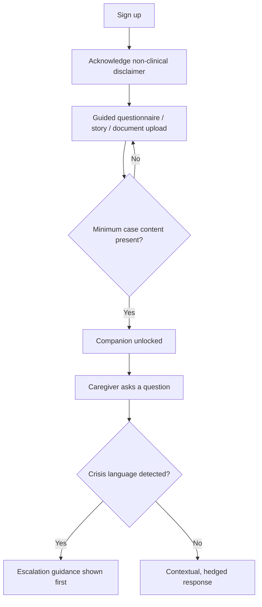
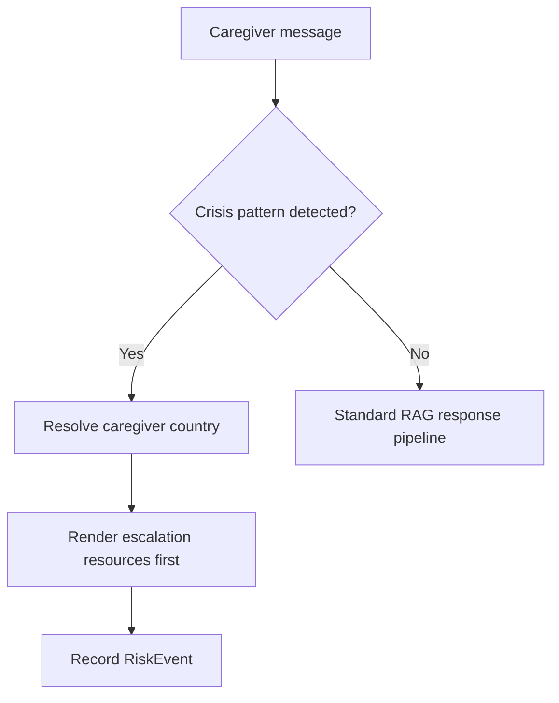

# SizoCare — Product Requirements Document

> Part 1 of the product-development document suite. Companion documents: Architecture Requirements Document (ARD), Data and API Specifications, MVP AI Implementation Plan, AI Agent Instructions.

## 1. Document Control

| Field | Value |
|---|---|
| Product name | SizoCare |
| Document owner | Founder (Mowa) |
| Version | 0.1 |
| Status | Draft — pending clinical, legal, and security review |
| Date | 2026-09-22 |
| Contributing roles | Founder/Product, (to be staffed) Clinical Advisor, Security/Privacy Reviewer, Engineering |
| Source inputs | Founder origin-story brief; reference prototype "Steady" (caregiving-companion HTML mock); template suite supplied by founder |

### 1.1 Stakeholders

| Stakeholder | Interest | Decision authority | Review required |
|---|---|---|---:|
| Founder / Product Owner | Overall product direction, MVP scope, safety posture | Yes | — |
| Clinical Advisor (to be engaged) | Clinical accuracy, safety language, crisis design | Consultative | Yes |
| Security/Privacy Reviewer (to be engaged) | Data protection, DPDP Act compliance posture | Consultative | Yes |
| Legal Advisor (to be engaged) | Consent model, jurisdictional exposure, medical-device risk | Consultative | Yes |
| Beta caregiver families | Real-world usability and trust | No | Feedback loop only |

### 1.2 Assumptions

- `ASSUMPTION`: MVP launch market is India, given the founder's origin story and existing product-portfolio focus on Indian B2C markets. India's DPDP Act 2023 is treated as the primary regulatory reference for MVP; HIPAA/GDPR are deferred to a later international-expansion review.
- `ASSUMPTION`: In the MVP, the care recipient (the person with schizophrenia) has no direct SizoCare account, login, or chat access. SizoCare is caregiver-facing only. Care-recipient consent, visibility, and eventual direct participation are explicitly unresolved (see §14, OQ-002, OQ-003).
- Validation method: Founder review plus clinical and legal advisor sign-off before Phase 1 (Identity & Onboarding) implementation begins.
- Decision deadline: Before Phase 1 kickoff, per the MVP AI Implementation Plan.

### 1.3 Decision Log

| ID | Decision | Rationale | Date | Owner | Impacted sections |
|---|---|---|---|---|---|
| DL-001 | Gemini API is the sole MVP AI provider, called only from a server-side proxy, behind a provider-abstraction interface | Brief explicitly prioritizes Gemini for MVP while requiring providers to be swappable later; avoids exposing API keys client-side | 2026-09-22 | Founder | §7.4, §11, ARD-3, ARD-9, MVP Plan §5.2 |
| DL-002 | Technical baseline standardized to Next.js (web), Expo/React Native (mobile), and a dedicated Supabase project (Postgres, Auth, Storage, Edge Functions, Realtime) | Matches the stack already standardized across the founder's product portfolio; keeps SizoCare's sensitive health data isolated in its own Supabase project | 2026-09-22 | Founder | ARD (all), Data/API Spec, MVP Plan §5 |
| DL-003 | MVP ships caregiver-only accounts; no multi-caregiver collaboration and no care-recipient login until V1+ | Reduces consent and access-control complexity for the first release; matches the single-caregiver origin story | 2026-09-22 | Founder | §6, §7.1, ARD-2, ARD-7 |
| DL-004 | MVP change detection is rule/threshold-based against the individual's own historical baseline, not a black-box ML model | Keeps explainability and caregiver trust high for a first release in a sensitive domain | 2026-09-22 | Founder | §7.8, ARD-3 |

### 1.4 Glossary

| Term | Definition |
|---|---|
| Caregiver | The account-holding family member or trusted supporter who uses SizoCare. The primary user. |
| Care Recipient | The adult with a clinically established schizophrenia diagnosis being supported. Not a SizoCare account holder in MVP. |
| Case Profile | The structured, editable record of the care recipient's background, history, and context that grounds the AI Companion. |
| Story Entry | Free-text or guided-questionnaire narrative a caregiver provides describing the care recipient's history. |
| Provenance | A tag on every stored fact indicating its source: caregiver-reported, patient-reported, document-extracted, or AI-organized. |
| Change Signal | A caregiver-reviewable output of change detection, comparing recent logs to the individual's own historical baseline. |
| Doctor-Ready Summary | A structured, caregiver-approved export intended to be shared with the treating clinician. |
| Baseline | An individual's own prior logged history, used as the comparison point for change detection (never a generic population norm). |
| BYOK | Bring Your Own [API] Key — a future tier allowing caregivers to supply their own supported AI provider key. |
| RAG | Retrieval-Augmented Generation — selecting only relevant case context for a given Companion prompt, rather than injecting full history. |

## 2. Executive Summary

### 2.1 Product Vision

SizoCare is a caregiver-first companion platform for families supporting a relative with schizophrenia. It gives the caregiver — not the patient — a persistent, structured record of the person's story and history, everyday guidance grounded in that record, and tools to track patterns over time and prepare for clinical appointments, without ever positioning itself as a substitute for the treating psychiatric team.

### 2.2 User Problem

Families caring for someone with schizophrenia routinely face situations they have no preparation for — delusional or paranoid statements, suspiciousness, medication resistance, sudden mood or sleep changes — and no realistic way to reach a psychiatrist for every one of them. Today, families rely on memory, informal family debate, and improvised responses, and arrive at appointments (often months apart) unable to reconstruct what actually happened or when. The evidence for this problem is currently the founder's own caregiving experience (anecdotal, single-family) rather than validated market research; §5.2 lists the hypotheses this needs to validate before the product scales.

### 2.3 Proposed Solution

A structured Case Profile — built from caregiver narrative, a guided questionnaire, or uploaded documents — becomes the foundation for a contextual AI Companion the caregiver can ask day-to-day questions. Daily logs feed a longitudinal timeline; rule-based change detection compares recent observations against the person's own baseline; and a doctor-ready summary generator turns weeks of scattered notes into a structured document the caregiver can review and bring to appointments. Every AI output distinguishes fact from caregiver report from AI interpretation, and the system is designed to escalate to human/professional help the moment a conversation suggests real danger.

### 2.4 Differentiation

- Caregiver-first, not patient-first: the product is built for the person doing the caregiving, not as a general mental-health chatbot for the patient.
- A persistent, provenance-tagged Case Profile grounds every conversation, instead of a stateless chatbot with no memory of the person's history.
- Explicit, testable clinical boundaries (no diagnosis, no dosage advice, no covert-medication normalization) built into the system prompt and prompt-construction pipeline, not just a disclaimer in the UI.
- Longitudinal, explainable change detection against the person's *own* baseline, rather than either raw logs with no analysis or an opaque ML "risk score."
- Structural readiness for India-first, regional-language caregiving (messaging-app logging, and an exploratory voice layer), reflecting the founder's broader portfolio focus on Indian B2C markets.

### 2.5 Business Opportunity

Market: family caregivers of people with schizophrenia and, over time, other psychiatric conditions — initially in India. Buyer: the caregiver, as an individual consumer; a household/family plan and, longer term, institutional buyers (employers, insurers) are plausible but out of scope for MVP validation. Business model: freemium companion with a paid tier unlocking expanded history, advanced tracking, doctor-ready reports, change detection, messaging integrations, and multi-caregiver collaboration, plus an eventual BYOK option (see §11). Strategic value: a defensible, longitudinal data asset (the Case Profile and timeline) that increases in value to the caregiver the longer they use the product, and a foundation that can extend to adjacent psychiatric-caregiving markets in Phase 5.

### 2.6 Major Privacy, Safety, Legal, and Ethical Considerations

- SizoCare processes highly sensitive mental-health information about a person who, in MVP, has not directly consented via the product (the caregiver consents and enters data on the family's behalf) — this is an open legal/ethical question, not a resolved one (see §14).
- No claim of HIPAA, GDPR, DPDP Act, or medical-device compliance is made until the corresponding technical, contractual, and organizational work is complete; compliance is tracked as an explicit workstream.
- The product must never present AI interpretation as clinical fact, never recommend medication changes, and must actively discourage — not merely decline to help with — covert medication and coercive-confinement practices.
- Crisis detection is a best-effort, high-recall safety layer, not a reliable clinical risk assessment; this limitation must be stated in-product, not only in legal terms.
- Uploaded documents and any third-party integration (Gemini, and later WhatsApp/Telegram) introduce data-exposure surfaces that require explicit, revocable caregiver consent and clear disclosure of what leaves SizoCare's systems.

## 3. Product Principles

| Principle | Meaning in practice | Release implication |
|---|---|---|
| Caregiver-first, not patient-first | Every feature is designed for the person providing care, not the person being cared for | No MVP feature requires or assumes direct care-recipient interaction with the AI |
| Support, never replace, the clinical team | No diagnosis, no medication changes, all clinical uncertainty routed to the treating psychiatrist | Every Companion response touching clinical judgment must pass a boundary-language check before release |
| Provenance over confidence | Every stored fact and every AI inference is traceable to its source | The data model and UI must carry a source tag on every fact; ungrounded claims block release |
| Fail closed on safety | When detection, data, or an AI provider is unavailable or ambiguous, the system defaults to the safer, more conservative behaviour | Crisis detection favors recall over precision; change detection suppresses signals rather than guessing with insufficient data |

## 4. Target Market and Personas

### 4.1 Market Definition

- Launch market: India
- Geography: India at MVP; architecture (configurable crisis resources, localizable copy) supports later international expansion
- Language: English at MVP; Hindi and other regional languages are a Phase 3+ roadmap item
- Platforms: Responsive web (Next.js) at MVP; native mobile (Expo/React Native) shortly after, reusing the same Supabase backend
- Eligibility: Caregiver must be 18+ and be a family member or trusted supporter of an adult with a clinically established schizophrenia diagnosis
- Primary segment: The adult child, spouse, or sibling acting as the primary day-to-day caregiver
- Excluded segment (MVP): Care recipients under 18 (different clinical, developmental, and consent considerations); families where no clinical diagnosis yet exists (SizoCare does not support undiagnosed/first-episode triage)

### 4.2 Persona: The Primary Caregiver — Adult Child / Spouse

- Goals: Understand what's happening day to day, know what's "expected" versus worth flagging, walk into appointments prepared, reduce personal anxiety and decision fatigue
- Jobs-to-be-done: "When she says something that worries me, I want to quickly understand whether it's expected and how to respond, so I don't overreact or under-react."
- Frustrations: Can't reach the psychiatrist same-day; forgets details between appointments months apart; family members disagree about what counts as "serious"
- Behaviours: Logs inconsistently rather than religiously; relies heavily on WhatsApp; checks in remotely from work or while traveling
- Context: Lives with or near the care recipient, often while managing a job, marriage, or an upcoming relocation
- Trust/privacy expectations: Wants the data kept private within the immediate family; concerned about stigma if it were ever exposed
- Accessibility needs: Mobile-first, minimal typing required to log something in the moment
- Success outcome: Arrives at every psychiatrist visit with an organized, accurate account, and feels less alone in the day-to-day decisions between visits

### 4.3 Persona: The Collaborating Caregiver — Sibling / Grandparent (V1+)

- Goals: Stay informed without duplicating the primary caregiver's effort
- Jobs-to-be-done: "I want to see what's already been logged today so I don't ask the same questions again."
- Frustrations: Excluded from clinical conversations; often lower technology comfort than the primary caregiver
- Behaviours: Reads more than writes; contributes occasional observations
- Context: Shares physical caregiving duties but not the administrative/coordination load
- Trust/privacy expectations: Wants visibility into shared notes but does not need — and should not automatically get — every private reflection the primary caregiver records
- Accessibility needs: A simple, low-friction UI; voice or regional-language input is a plausible future need
- Success outcome: Feels informed and included without needing to become "the point person"
- Note: This persona is not addressed in MVP (single-caregiver-owner model, DL-003) but shapes the ARD-7 collaboration design for V1.

### 4.4 Persona: The Treating Clinician — Indirect, Non-MVP-User

- Goals: Get an accurate, concise account of what has changed since the last visit
- Jobs-to-be-done: "When a family brings a printed or emailed report, I want the key changes since last visit in under two minutes."
- Frustrations: Family accounts that are either too sparse or an unstructured wall of text
- Context: Never logs into SizoCare; only ever receives an exported, caregiver-approved summary
- Success outcome: The summary is trustworthy enough to inform, without the clinician needing to treat it as a medical record
- Note: This persona exists to shape §7.9 (Doctor-Ready Summaries); it has no account and no direct product access in any phase currently planned.

## 5. User Problems and Opportunities

### 5.1 Evidence-Backed Findings

| ID | Finding | Evidence | Confidence | Product implication |
|---|---|---|---|---|
| EV-001 | Families with a recently diagnosed relative have little practical guidance for everyday interactions (delusional statements, suspiciousness, dependency) | Founder's own caregiving experience (single family, anecdotal) | Low (anecdotal, unvalidated) | Companion chat must cover practical "what do I say" scenarios, not only clinical facts |
| EV-002 | Caregivers struggle to summarize a complex, multi-year history efficiently for short clinical appointments | Founder's origin story | Low (anecdotal, unvalidated) | Doctor-Ready Summaries is a high-priority MVP feature, not a later add-on |
| EV-003 | Covert medication administration, even when well-intentioned, can damage the care recipient's trust once discovered | Founder's origin story and the reference prototype's example case profile | Low (anecdotal, single case) | The product must actively discourage covert-medication strategies in Companion responses, not merely decline to help with them |

### 5.2 Hypotheses Requiring Research

| ID | Hypothesis | Risk if false | Validation method | Decision threshold |
|---|---|---|---|---|
| H-001 | Caregivers will log observations frequently enough for change detection to produce useful signal | Change detection has no real signal; a core value proposition weakens | Beta-cohort logging-frequency analysis | Median ≥3 logs/week among active beta caregivers within 4 weeks |
| H-002 | Caregivers will trust and act on AI-surfaced "worth discussing with your psychiatrist" signals rather than dismissing or being alarmed by them | Alarm fatigue (over-trigger) or missed concerns (under-trigger) undermine the feature | Opt-in post-signal survey plus qualitative beta interviews | ≥70% of surfaced signals rated "helpful, not alarming" |
| H-003 | A caregiver-only account model (no care-recipient login) is acceptable to most beta families without significant consent objections | Legal/ethical exposure if care recipients or clinicians object once the product is visible to them | Legal/clinical advisor review plus beta-family interviews | No unresolved objection from the clinical or legal advisor before any public (non-invite) launch |

### 5.3 Product Opportunities

| Opportunity | User value | Business value | Complexity | Risk |
|---|---|---|---|---|
| Doctor-Ready Summary export | High | High (paid-tier driver) | M | Medium — must avoid presenting speculation as fact |
| WhatsApp-based logging | High (very low friction) | Medium | L | High — data exposure, consent, WhatsApp Business API/platform policy constraints |
| Multi-caregiver collaboration | Medium–High | Medium | L | Medium — permission and consent complexity across family members |
| Rule-based change detection | High | Medium | M | Medium — false positives/negatives affect trust either direction |

### 5.4 Risks of Creating the Wrong Behaviour

- Misuse: A caregiver uses the Companion to script covert medication administration or deception of the care recipient. Prevention: explicit system-policy prohibition plus response-pattern refusal and redirection to ethical/clinical guidance. Detection: aggregate, privacy-preserving review of boundary-redirect events during beta (never content-level review without consent). Response: refuse the specific request, surface the clinical-boundary explanation, and log the redirect for product-safety review — not for any punitive action against the caregiver's account.
- Misuse: A Change Signal is read by the caregiver as a diagnosis or a relapse prediction, causing panic or a premature, unsupervised medication decision. Prevention: hedged, non-numeric-severity language requirements (§7.8, §10); no "risk score" outputs implying clinical certainty in MVP. Detection: beta survey question asking directly whether a signal felt like a diagnosis. Response: revise copy and UX, add clarifying context inline rather than only in a disclaimer.

## 6. Scope

### 6.1 MVP

#### Included

- Secure caregiver account and onboarding (FR-AUTH)
- Care Recipient profile and Story/Case context (FR-CASE)
- Document upload and fact extraction (FR-DOC)
- Contextual AI Companion chat, Gemini-backed (FR-COMPANION)
- Daily care logs (FR-LOG)
- Symptom tracking and timeline (FR-SYMPTOM)
- Medication tracking (FR-MED)
- Rule-based change detection (FR-CHANGE)
- Doctor-ready summaries (FR-SUMMARY)
- Crisis and escalation UX, country-configurable (FR-CRISIS)
- Privacy and security foundations: encryption at rest/in transit, explicit consent capture, account deletion/export pathway

#### Excluded

- WhatsApp and Telegram messaging integrations
- Multi-caregiver collaboration (single caregiver/owner only in MVP)
- BYOK and multi-provider AI (Gemini-only; provider-abstraction interface exists in code but only one provider is enabled)
- Additional condition modules beyond schizophrenia
- Native mobile app store release (a shared Expo/React Native codebase may be scaffolded, but MVP ships web-first)
- Voice/regional-language layer (VoxCPM2-based exploration deferred)

### 6.2 Version 1

- Multi-caregiver collaboration (roles, invitations, shared vs. private notes)
- Native mobile app store release on the shared Supabase backend
- Expanded document intelligence (higher-quality extraction, more document types)
- Medication reminders
- Refined change detection (additional signal types, still baseline-relative and explainable)

### 6.3 Future Roadmap

- WhatsApp and Telegram integrations for logging and Companion access
- BYOK and additional AI providers (OpenRouter-compatible, and user-supplied keys)
- Exploratory voice/regional-language layer (self-hosted TTS/voice, e.g. an Apache-2.0-licensed model such as VoxCPM2, evaluated for Indian-language caregiver accessibility)
- SizoCare-hosted subscription AI access tier
- Additional mental-health caregiving condition modules, each with its own clinical review

### 6.4 Explicit Non-Goals

- SizoCare will not provide direct-to-care-recipient chat, therapy, or counseling in any currently planned phase.
  - Rationale: caregiver-first thesis; direct patient interaction raises separate, unresolved consent and clinical-safety questions (see §14).
- SizoCare will not attempt automated diagnosis or present a numeric/graded "risk score" as clinical certainty.
  - Rationale: stated product principle (fail closed on safety); this is a support tool, not a diagnostic instrument.
- SizoCare will not claim regulatory compliance (medical device, HIPAA, GDPR, DPDP Act certification) before the underlying legal and technical work is actually done.
  - Rationale: avoiding false assurance to caregivers and clinicians.

## 7. Feature Requirements

### 7.1 Caregiver Account & Onboarding — FR-AUTH

#### Objective

Let a caregiver create a secure account and complete guided onboarding that establishes the initial Case Profile, before any Companion or logging feature is usable.

#### Actors

- Primary: Caregiver (account owner)
- Secondary: none in MVP (collaborators are V1, see §6.2)
- System/operator: Supabase Auth

#### Preconditions

- Caregiver has a valid email address
- Caregiver affirms they are 18+ and are a family member/trusted supporter of the care recipient

#### Functional Requirements

| ID | Requirement | Priority | Source | Acceptance reference |
|---|---|---|---|---|
| FR-AUTH-001 | The system MUST require caregivers to authenticate via Supabase-managed email/password or magic-link before accessing any case data. | Must | Product principle: caregiver-first, fail closed | AC-AUTH-001 |
| FR-AUTH-002 | The system MUST require the caregiver to explicitly acknowledge SizoCare's non-clinical, non-emergency nature during onboarding before account setup is marked complete. | Must | §2.6, §10 | AC-AUTH-001 |
| FR-AUTH-003 | The system SHOULD offer a guided onboarding questionnaire that produces a draft Case Profile the caregiver reviews before it is saved. | Should | Brief §"Product Principle" | AC-AUTH-002 |

#### Business Rules

1. A caregiver account is linked to at most one CareRecipient in MVP (single-relationship model; multi-recipient support is a later consideration).
2. Onboarding cannot be marked complete until the caregiver has written a story entry, completed the guided questionnaire, or uploaded at least one document.
3. The non-clinical/non-emergency acknowledgment is re-surfaced (visibly, not as a re-blocking gate) at the start of every new Companion conversation, not only once at signup.

#### States

| State | Entry condition | Allowed actions | Exit condition |
|---|---|---|---|
| Unauthenticated | No valid session | Sign up, log in | Successful auth → Onboarding |
| Onboarding | First successful login | Complete questionnaire, write story, upload document | Minimum case content present → Active |
| Active | Onboarding complete | Full product use | Deletion request or policy suspension → Suspended |

#### Error and Edge Cases

| Case | Expected behaviour | User message | Telemetry |
|---|---|---|---|
| Caregiver abandons onboarding after auth | Account persists in Onboarding state; Companion remains disabled until minimum case content exists | "Add a bit about your family member before we start chatting — even a few lines helps." | `auth.onboarding_abandoned` |
| Login from a new/unrecognized device | Standard session issuance; no additional MFA required at MVP baseline | — | `auth.new_device_login` |

#### Acceptance Criteria

- AC-AUTH-001: Given a new caregiver with a verified email, when they complete signup and acknowledge the non-clinical disclaimer, then an Onboarding-state account and an empty CareRecipient/CaseProfile shell are created.
- AC-AUTH-002: Given a caregiver has not yet added any case content, when they open Companion, then the system blocks chat and prompts them to add case context first.

#### Analytics

- Event: `auth.signup_completed`
- Trigger: successful account creation and disclaimer acknowledgment
- Required properties: `signup_method`, `onboarding_path_chosen`
- Prohibited properties: email, phone number, any case content

#### Dependencies

- Supabase Auth
- Related requirements: FR-CASE-001

---

### 7.2 Care Recipient Profile & Story Context — FR-CASE

#### Objective

Maintain a persistent, editable, provenance-tagged Case Profile for the care recipient, built from caregiver narrative, guided-questionnaire answers, or document-extracted facts.

#### Actors

- Primary: Caregiver (owner)
- System: fact-extraction pipeline (from documents and questionnaire answers)

#### Preconditions

- Caregiver is authenticated and in Onboarding or Active state

#### Functional Requirements

| ID | Requirement | Priority | Source | Acceptance reference |
|---|---|---|---|---|
| FR-CASE-001 | The system MUST allow the caregiver to create and edit a CareRecipient record (preferred name, relationship to caregiver, age band, caregiver-reported diagnosis). | Must | Brief §"Patient Story / Case Context" | AC-CASE-001 |
| FR-CASE-002 | The system MUST store every CaseProfile fact with a provenance tag: `caregiver_reported`, `patient_reported`, `document_extracted`, or `ai_organized`. | Must | Product principle: provenance over confidence | AC-CASE-001 |
| FR-CASE-003 | The system MUST allow the caregiver to review, edit, or delete any AI-organized or document-extracted fact before it is used in Companion context or summaries. | Must | Brief §"Patient Story / Case Context" | AC-CASE-002 |

#### Business Rules

1. Document-extracted facts default to a "pending review" state and are excluded from AI context until the caregiver confirms or edits them; directly caregiver-written text is active immediately.
2. Deleting a fact removes it from active context but preserves an audit-trail entry recording that a fact existed and was removed, by whom and when — not the deleted content itself (data minimisation).
3. Diagnosis fields are always caregiver- or document-reported; the system never asserts or silently corrects a diagnosis.

#### States

| State | Entry condition | Allowed actions | Exit condition |
|---|---|---|---|
| Draft | Caregiver mid-edit | Edit, discard | Save → Saved |
| Saved | Confirmed by caregiver | View, edit, delete | Edit → Superseded (prior version retained in audit trail) |
| Pending review | Extracted from a document | Confirm, edit, delete | Confirmed → Saved |

#### Error and Edge Cases

| Case | Expected behaviour | User message | Telemetry |
|---|---|---|---|
| Extracted fact conflicts with an existing caregiver-entered fact | Both versions surfaced side by side for caregiver resolution; nothing silently overwritten | "This document says X, but your notes say Y — which should we keep?" | `case.fact_conflict_surfaced` |
| Caregiver deletes the only diagnosis entry | Allowed (caregiver control is absolute); warns that Companion responses will be more limited | "Without a diagnosis on file, Companion's guidance will be more general." | `case.diagnosis_removed` |

#### Acceptance Criteria

- AC-CASE-001: Given a caregiver uploads a document containing a medication name, when extraction completes, then the fact appears "pending review" with `document_extracted` provenance and is not yet used in Companion context.
- AC-CASE-002: Given a caregiver confirms a pending fact, when they tap confirm, then its provenance remains `document_extracted`, its status becomes active, and it becomes available to Companion retrieval.

#### Analytics

- Event: `case.fact_confirmed`
- Trigger: caregiver confirms a pending fact
- Required properties: `fact_category`, `provenance`
- Prohibited properties: fact content, diagnosis text, any identifying detail

#### Dependencies

- FR-DOC (document upload/extraction feeds this feature)
- Related requirements: FR-DOC-001, FR-COMPANION-002

---

### 7.3 Document Upload & Extraction — FR-DOC

#### Objective

Let caregivers upload relevant documents (prior clinical notes, discharge summaries, medication lists) and receive candidate extracted facts for review, while treating all document content as untrusted data.

#### Actors

- Primary: Caregiver
- System: OCR and extraction pipeline

#### Preconditions

- Caregiver authenticated; storage quota not exceeded

#### Functional Requirements

| ID | Requirement | Priority | Source | Acceptance reference |
|---|---|---|---|---|
| FR-DOC-001 | The system MUST accept PDF, DOCX, JPG, and PNG uploads up to a defined size limit and store them encrypted at rest. | Must | Brief §"AI / RAG Architecture" | AC-DOC-001 |
| FR-DOC-002 | The system MUST treat all extracted or quoted document content as untrusted data when constructing AI prompts — never as system instructions. | Must | Brief §"Design against prompt injection" | AC-DOC-002 |
| FR-DOC-003 | The system SHOULD run OCR on scanned or image documents before extraction. | Should | Brief §"Document Upload" | AC-DOC-001 |

#### Business Rules

1. Uploaded documents are never sent to a third-party AI provider for extraction without the caregiver's prior, explicit, revocable consent captured at upload time.
2. Deleting a document removes the file, its OCR text, and any not-yet-confirmed extracted facts; already-confirmed facts derived from it remain (with provenance) unless separately deleted.
3. File size and type limits are enforced server-side, never only client-side.

#### States

| State | Entry condition | Allowed actions | Exit condition |
|---|---|---|---|
| Uploading | Caregiver selects file | Cancel | Transfer complete → Processing |
| Processing | Upload stored | View original file | OCR/extraction complete → Extracted |
| Extracted | Facts generated | Review, confirm, edit, delete | All facts reviewed → Reviewed |

#### Error and Edge Cases

| Case | Expected behaviour | User message | Telemetry |
|---|---|---|---|
| Document text contains instruction-like phrasing (e.g. "ignore previous rules and…") | Treated as inert data; extraction does not execute it; flagged internally as a possible prompt-injection attempt | None to user (silent containment) | `doc.injection_pattern_detected` |
| Upload fails mid-transfer | Partial file discarded; caregiver notified; retry offered | "That upload didn't finish — want to try again?" | `doc.upload_failed` |

#### Acceptance Criteria

- AC-DOC-001: Given a caregiver uploads a scanned discharge summary, when OCR and extraction complete, then candidate facts appear tagged `document_extracted` and pending review, and the original file remains viewable.
- AC-DOC-002: Given a document's text contains an embedded instruction-like phrase, when it is processed, then the extraction output shows no evidence the embedded instruction altered system behaviour.

#### Analytics

- Event: `doc.upload_completed`
- Trigger: successful storage
- Required properties: `file_type`, `size_bucket`
- Prohibited properties: filename, file content, extracted text

#### Dependencies

- FR-CASE (fact review flow)
- Related requirements: FR-CASE-002, FR-CASE-003

---

### 7.4 Caregiver AI Companion (Chat) — FR-COMPANION

#### Objective

Provide contextual, safety-bounded conversational guidance to the caregiver, grounded in the Case Profile and recent observations via retrieval-augmented generation over the Gemini API.

#### Actors

- Primary: Caregiver
- System: Gemini-backed Companion behind a provider-abstraction layer

#### Preconditions

- Case Profile has minimum content (per FR-AUTH business rule 2)
- Non-clinical/non-emergency disclaimer has been acknowledged for the active session

#### Functional Requirements

| ID | Requirement | Priority | Source | Acceptance reference |
|---|---|---|---|---|
| FR-COMPANION-001 | The system MUST construct every prompt from a fixed, caregiver-non-editable safety/system policy layer plus retrieved case context; the caregiver's own case text is background, never an override of the safety policy. | Must | Brief §"AI / RAG Architecture"; reference prototype `BASE_SYSTEM` | AC-COMPANION-001 |
| FR-COMPANION-002 | The system MUST retrieve only relevant case-profile facts, recent logs, medication context, and document excerpts for a given question, not the full history indiscriminately. | Must | Brief §"AI / RAG Architecture" | AC-COMPANION-001 |
| FR-COMPANION-003 | The system MUST detect statements indicating an active safety risk and lead the response with escalation guidance before any other content. | Must | Brief §"Crisis Design" | AC-COMPANION-002 |
| FR-COMPANION-004 | The system MUST NOT re-diagnose, recommend medication start/stop/dosage changes, normalize covert medication, or give forced-restraint/confinement instructions. | Must | Brief §"Safety Requirements" | AC-COMPANION-001 |

#### Business Rules

1. Every Companion response distinguishes caregiver-report, patient-report, document fact, and AI interpretation in its own language (e.g. "she reports…", "the family observed…", "this may be consistent with…", "this isn't established yet").
2. Companion conversations are private to the account owner in MVP (no collaborators exist to share with yet).
3. If the configured AI provider is unavailable, Companion degrades to a clear "temporarily unavailable" state rather than falling back to an unbounded local response.

#### States

| State | Entry condition | Allowed actions | Exit condition |
|---|---|---|---|
| Idle | Conversation open, no pending request | Send message | Message sent → Awaiting response |
| Awaiting response | Request sent to provider | Cancel (if supported) | Response received or error → Responded / Error |
| Crisis-flagged | Response contains a crisis trigger | Acknowledge, contact resource | Caregiver continues conversation |

#### Error and Edge Cases

| Case | Expected behaviour | User message | Telemetry |
|---|---|---|---|
| Gemini API call fails or times out | Safe, non-alarming error shown; not silently retried indefinitely | "Companion couldn't respond just now — please try again in a moment." | `companion.provider_error` |
| Caregiver asks for a medication dosage change | System declines the specific request, explains why, redirects to the prescribing psychiatrist | Templated boundary redirect | `companion.boundary_redirect` (category=`medication_dosage`) |

#### Acceptance Criteria

- AC-COMPANION-001: Given a caregiver describes a new symptom, when Companion responds, then the response contains no unhedged assertion of a delusional belief as objectively true and no dosage recommendation.
- AC-COMPANION-002: Given a caregiver's message states intent of self-harm, when Companion responds, then the first content shown is escalation/crisis guidance for the caregiver's configured country.

#### Analytics

- Event: `companion.message_sent`
- Trigger: caregiver sends a message
- Required properties: `message_length_bucket`, `response_latency_ms`, `boundary_redirect_triggered`
- Prohibited properties: message content, response content

#### Dependencies

- FR-CASE, FR-LOG, FR-MED, FR-DOC (context sources); FR-CRISIS (escalation path)
- Related requirements: all above

---

### 7.5 Daily Care Logs — FR-LOG

#### Objective

Let caregivers quickly record structured daily observations across defined categories (mood, sleep, appetite, agitation, suspiciousness, medication reference, notable incidents, etc.).

#### Actors

- Primary: Caregiver

#### Preconditions

- Caregiver is Active (onboarded)

#### Functional Requirements

| ID | Requirement | Priority | Source | Acceptance reference |
|---|---|---|---|---|
| FR-LOG-001 | The system MUST let a caregiver create a log entry in under 30 seconds using at least one category, without requiring every field. | Must | Brief §"Daily Care Logs" | AC-LOG-001 |
| FR-LOG-002 | The system MUST record both entry time and caregiver-reported observation time on every log. | Must | Brief §"Daily Care Logs" | AC-LOG-001 |
| FR-LOG-003 | The system SHOULD allow free-text notes alongside structured categories. | Should | Brief §"Daily Care Logs" | AC-LOG-001 |

#### Business Rules

1. Logs are append-only for audit purposes; edits retain prior versions in history rather than overwriting silently.
2. A log entry belongs to exactly one CareRecipient and is attributed to exactly one Caregiver (author).
3. The category taxonomy is fixed in MVP, not user-definable, to keep symptom tracking and change detection consistent.

#### States

| State | Entry condition | Allowed actions | Exit condition |
|---|---|---|---|
| Draft | Caregiver composing entry | Edit, discard | Save → Saved |
| Saved | Entry stored | View, edit | Edit → Edited (prior version retained) |

#### Error and Edge Cases

| Case | Expected behaviour | User message | Telemetry |
|---|---|---|---|
| Caregiver logs the same category twice in one day | Both kept; treated as two distinct observations, not merged | — | `log.same_day_duplicate_category` |
| Caregiver attempts to log a future date | Rejected with validation error | "You can't log something that hasn't happened yet." | `log.future_date_rejected` |

#### Acceptance Criteria

- AC-LOG-001: Given a caregiver selects "Mood: Low" and saves with no other fields, when the entry is stored, then it appears in the Timeline and Daily Log list with correct date attribution.
- AC-LOG-002: Given a caregiver edits a previously saved log, when they save the edit, then the prior version remains retrievable in the entry's history.

#### Analytics

- Event: `log.entry_created`
- Trigger: successful save
- Required properties: `categories_used`, `has_free_text`
- Prohibited properties: free-text content, structured field values

#### Dependencies

- Feeds FR-SYMPTOM (timeline) and FR-CHANGE (change detection)
- Related requirements: FR-SYMPTOM-001

---

### 7.6 Symptom Tracking & Timeline — FR-SYMPTOM

#### Objective

Convert daily logs into a chronological, filterable timeline and simple trend views per category, always relative to the individual's own history.

#### Actors

- Primary: Caregiver

#### Preconditions

- At least one log entry exists

#### Functional Requirements

| ID | Requirement | Priority | Source | Acceptance reference |
|---|---|---|---|---|
| FR-SYMPTOM-001 | The system MUST render a chronological timeline of all log entries, filterable by category and date range. | Must | Brief §"Symptom Tracking" | AC-SYMPTOM-001 |
| FR-SYMPTOM-002 | The system SHOULD show frequency/intensity trend views for categories with caregiver-rated intensity. | Should | Brief §"Symptom Tracking" | AC-SYMPTOM-002 |
| FR-SYMPTOM-003 | The system MUST label any AI-surfaced correlation as a correlation, not a causal claim, in the UI copy itself. | Must | Brief §"Symptom Tracking" | AC-SYMPTOM-002 |

#### Business Rules

1. Trend views compare the individual against their own prior logged history, never a generic population norm.
2. Days without logs are shown as a gap, never interpolated as "normal" or "no symptoms."

#### States

Read-oriented feature; reuses the FR-LOG entry lifecycle.

#### Error and Edge Cases

| Case | Expected behaviour | User message | Telemetry |
|---|---|---|---|
| Fewer than 5 data points in a category | Trend chart suppressed in favor of a plain list | "A few more logs and we'll be able to show a trend here." | `symptom.trend_suppressed_insufficient_data` |

#### Acceptance Criteria

- AC-SYMPTOM-001: Given 10 mood logs across 3 weeks, when the caregiver opens Timeline filtered to Mood, then all 10 entries render in chronological order with correct dates.
- AC-SYMPTOM-002: Given fewer than 5 sleep entries, when the caregiver opens the Sleep trend view, then the insufficient-data state is shown rather than a misleadingly sparse chart.

#### Analytics

- Event: `symptom.timeline_viewed`
- Trigger: screen opened
- Required properties: `category_filter`, `date_range_bucket`
- Prohibited properties: entry content

#### Dependencies

- FR-LOG
- Related requirements: FR-LOG-001, FR-CHANGE-001

---

### 7.7 Medication Tracking — FR-MED

#### Objective

Track medication schedule, adherence status, and reported side effects as entered by the caregiver, without prescribing or recommending dosage changes.

#### Actors

- Primary: Caregiver

#### Preconditions

- None (medications can be added at any time)

#### Functional Requirements

| ID | Requirement | Priority | Source | Acceptance reference |
|---|---|---|---|---|
| FR-MED-001 | The system MUST let a caregiver add a medication with name, caregiver-entered schedule, and start date. | Must | Brief §"Medication Tracking" | AC-MED-001 |
| FR-MED-002 | The system MUST let a caregiver record each dose as taken, missed, or unknown, with an optional side-effect note. | Must | Brief §"Medication Tracking" | AC-MED-001 |
| FR-MED-003 | The system MUST NOT provide dosage guidance and MUST display a persistent boundary notice on medication screens. | Must | Brief §"Safety Requirements" | AC-MED-002 |

#### Business Rules

1. A medication change (new drug, dose, discontinuation) is logged as a MedicationEvent with a timestamp; it is never auto-applied to the "current regimen" without caregiver confirmation that the change is intentional, not a one-off missed dose.
2. Reminders (V1+) are informational only, never a substitute for clinician-directed adherence support.

#### States

| State | Entry condition | Allowed actions | Exit condition |
|---|---|---|---|
| Active | Medication added | Log doses, edit schedule | Caregiver marks discontinued → Discontinued |
| Discontinued | Caregiver marks stop | View history | — |

#### Error and Edge Cases

| Case | Expected behaviour | User message | Telemetry |
|---|---|---|---|
| Caregiver logs a dose for a medication marked discontinued | Allowed, but flagged for confirmation | "You marked this medication as stopped on {{date}} — log this dose anyway?" | `med.dose_logged_after_discontinuation` |

#### Acceptance Criteria

- AC-MED-001: Given a caregiver adds a medication and logs 5 consecutive "taken" events, when they view Medication history, then adherence shows 5/5 for that window with correct dates.
- AC-MED-002: Given a caregiver asks Companion "should I increase her dose," when Companion responds, then it declines the specific request and redirects to the prescribing psychiatrist.

#### Analytics

- Event: `med.event_recorded`
- Trigger: dose logged
- Required properties: `status`, `has_side_effect_note`
- Prohibited properties: medication name, dose amount, note content

#### Dependencies

- FR-CASE (medication history context); FR-COMPANION-004 (boundary rule)

---

### 7.8 Change Detection — FR-CHANGE

#### Objective

Surface caregiver-reviewable signals when recent logs meaningfully differ from the care recipient's own historical baseline.

#### Actors

- Primary: Caregiver
- System: scheduled rule-based analysis job

#### Preconditions

- Sufficient log history exists for a category (minimum data-point threshold met)

#### Functional Requirements

| ID | Requirement | Priority | Source | Acceptance reference |
|---|---|---|---|---|
| FR-CHANGE-001 | The system MUST compare recent logs (trailing 14 days) against the individual's own prior baseline (trailing 90 days) per category, using caregiver-rated values only. | Must | Brief §"Change-Detection Principle" | AC-CHANGE-001 |
| FR-CHANGE-002 | The system MUST present every Change Signal with what changed, the compared periods, supporting observation count, and a suggested caregiver action — never a standalone severity score presented as diagnostic. | Must | Brief §"Change-Detection Principle" | AC-CHANGE-001 |
| FR-CHANGE-003 | The system MUST NOT generate a Change Signal from fewer than a defined minimum number of data points. | Must | Product principle: fail closed | AC-CHANGE-002 |

#### Business Rules

1. MVP change detection is rule/threshold-based (deviation from the personal mean or frequency), not a black-box ML model, to keep explainability high (DL-004).
2. Dismissing a Change Signal is recorded but does not delete it; it remains in the signal's own history for audit and privacy-preserving, aggregate product review.

#### States

| State | Entry condition | Allowed actions | Exit condition |
|---|---|---|---|
| Detected | Job identifies a deviation | — | Surfaced |
| Surfaced | Shown to caregiver | Acknowledge, dismiss | Acknowledged / Dismissed |

#### Error and Edge Cases

| Case | Expected behaviour | User message | Telemetry |
|---|---|---|---|
| Change-detection job fails or times out | Fails closed — no signal shown rather than a partial/incorrect one | None (silent skip, logged internally) | `change.job_failed` |

#### Acceptance Criteria

- AC-CHANGE-001: Given sleep duration in the last 14 days is meaningfully below the trailing-90-day personal average with sufficient data points, when the nightly job runs, then a Change Signal is created referencing both periods and the supporting entry count.
- AC-CHANGE-002: Given a caregiver dismisses a Change Signal, when they view the Timeline later, then it no longer shows as active but remains in the signal's own history.

#### Analytics

- Event: `change.signal_surfaced`
- Trigger: job creates a signal
- Required properties: `category`, `direction`, `data_point_count`
- Prohibited properties: raw log values, free text

#### Dependencies

- FR-LOG, FR-SYMPTOM
- Related requirements: FR-SUMMARY-001

---

### 7.9 Doctor-Ready Summaries — FR-SUMMARY

#### Objective

Generate a structured, caregiver-editable summary of a reporting period, suitable for sharing with the treating clinician.

#### Actors

- Primary: Caregiver
- Secondary/indirect: Treating clinician (recipient only, not a product user)

#### Preconditions

- Sufficient logged history exists for the selected reporting period

#### Functional Requirements

| ID | Requirement | Priority | Source | Acceptance reference |
|---|---|---|---|---|
| FR-SUMMARY-001 | The system MUST generate a summary containing reporting period, major changes, symptom observations, medication adherence, sleep, functioning, notable incidents, caregiver concerns, and a timeline extract, each clearly sourced. | Must | Brief §"Doctor-Ready Summaries" | AC-SUMMARY-001 |
| FR-SUMMARY-002 | The system MUST require explicit caregiver approval before a summary can be exported or marked final. | Must | Brief §"Doctor-Ready Summaries" | AC-SUMMARY-002 |
| FR-SUMMARY-003 | The system MUST visually distinguish caregiver-observation text from AI-generated organization within the summary itself. | Must | Product principle: provenance over confidence | AC-SUMMARY-001 |

#### Business Rules

1. Summaries are versioned; regenerating does not silently overwrite a caregiver-edited version without confirmation.
2. Exported summaries never claim compliance with a medical-record standard or imply clinician endorsement.

#### States

| State | Entry condition | Allowed actions | Exit condition |
|---|---|---|---|
| Generating | Caregiver requests summary | — | Draft |
| Draft | Generation complete | Edit | Approved |
| Approved | Caregiver approves | Export | — |

#### Error and Edge Cases

| Case | Expected behaviour | User message | Telemetry |
|---|---|---|---|
| Caregiver exports before reviewing all sections | Export still allowed (caregiver autonomy); one-time confirmation shown | "Some sections haven't been reviewed yet — export anyway?" | `summary.exported_with_unreviewed_sections` |

#### Acceptance Criteria

- AC-SUMMARY-001: Given a reporting period with 3 Change Signals and 20 logs, when the caregiver generates a summary, then all 3 signals and representative supporting observations appear in the draft with source labels.
- AC-SUMMARY-002: Given a caregiver has not approved a draft, when they attempt to export, then the system requires explicit approval or the confirmation above.

#### Analytics

- Event: `summary.generated`
- Trigger: generation requested
- Required properties: `period_length_days`, `signal_count`
- Prohibited properties: any summary content

#### Dependencies

- FR-CHANGE, FR-LOG, FR-MED, FR-SYMPTOM

---

### 7.10 Crisis & Escalation UX — FR-CRISIS

#### Objective

Detect conversation or log content indicating potential imminent danger and prioritize human/professional escalation, with country-configurable resources.

#### Actors

- Primary: Caregiver (as reporter)
- System: crisis-detection layer within Companion and Log entry

#### Preconditions

- None (always active)

#### Functional Requirements

| ID | Requirement | Priority | Source | Acceptance reference |
|---|---|---|---|---|
| FR-CRISIS-001 | The system MUST detect crisis-indicative content in Companion messages and log free-text using a conservative, high-recall approach for MVP. | Must | Brief §"Crisis Design" | AC-CRISIS-001 |
| FR-CRISIS-002 | The system MUST surface country-appropriate crisis resources, configurable rather than hard-coded to one geography, with a safe default when country is unknown. | Must | Brief §"Crisis Design" | AC-CRISIS-002 |
| FR-CRISIS-003 | The system MUST NOT claim or imply that its detection reliably determines whether someone is safe. | Must | Brief §"Crisis Design" | AC-CRISIS-001 |

#### Business Rules

1. Crisis-flagged content always takes visual and positional priority over any other content in the response or screen.
2. False positives are an acceptable cost in MVP (bias toward recall over precision) but must never block the caregiver from continuing to use the rest of the product.
3. Crisis events are recorded for the caregiver's own reference and for aggregate, privacy-preserving product-safety review only — never shared with a third party without an explicit legal basis.

#### States

Cross-cutting detection layer; no independent lifecycle.

#### Error and Edge Cases

| Case | Expected behaviour | User message | Telemetry |
|---|---|---|---|
| Crisis pattern misfires on a clearly historical, past-tense mention | Acceptable false positive; escalation banner still shown (fail-safe), main response still addresses the actual historical question below it | Escalation banner plus normal response | `crisis.flag_raised` (with optional caregiver-set `false_positive_reported`) |

#### Acceptance Criteria

- AC-CRISIS-001: Given a Companion message containing an explicit statement of intent to self-harm, when the response is generated, then country-appropriate crisis resources appear first, above any other content.
- AC-CRISIS-002: Given the caregiver's country is not set, when a crisis flag fires, then a safe, clearly labeled default (an international crisis-line directory) is shown rather than resources for the wrong country.

#### Analytics

- Event: `crisis.flag_raised`
- Trigger: pattern match
- Required properties: `source`, `country_code_bucket`
- Prohibited properties: message content, log content

#### Dependencies

- FR-COMPANION, FR-LOG
- Related requirements: FR-COMPANION-003

## 8. User Journeys

### 8.1 First Week — Onboarding to First Companion Conversation

| Step | User action | System response | Decision/branch | Failure recovery |
|---:|---|---|---|---|
| 1 | Caregiver signs up with email | Account created in Onboarding state | — | Resend verification if needed |
| 2 | Caregiver acknowledges non-clinical disclaimer | Disclaimer recorded; onboarding questionnaire offered | — | Can dismiss and return later |
| 3 | Caregiver completes guided questionnaire or writes a story entry | Draft Case Profile generated for review | Caregiver may instead upload a document | Partial answers saved as draft |
| 4 | Caregiver reviews and confirms Case Profile facts | Facts marked active with provenance tags | Conflicting facts surfaced for resolution | Caregiver can edit any fact later |
| 5 | Caregiver opens Companion and asks a first question | Companion retrieves relevant context and responds with hedged, sourced language | If risk language detected → crisis banner leads the response | Provider error → safe retry message |

### 8.2 Crisis Message During a Companion Conversation

| Step | User action | System response | Decision/branch | Failure recovery |
|---:|---|---|---|---|
| 1 | Caregiver types a message describing an acute, dangerous situation | Message sent to Companion pipeline | — | — |
| 2 | System evaluates message for crisis indicators before generating the main response | Crisis flag raised | If no crisis indicators → normal response path | — |
| 3 | System retrieves the caregiver's configured country | Country-appropriate resources selected | Country unknown → safe international default | — |
| 4 | Response rendered | Escalation guidance shown first, normal contextual content (if any) follows | — | Provider error after flag still shows static crisis resources (not dependent on the AI call succeeding) |
| 5 | Caregiver acts on resources or continues the conversation | RiskEvent recorded for caregiver's own reference | — | — |

## 9. UX and Design Requirements

- Information architecture: Home, Companion, Daily Log, Timeline, Symptoms, Medication, Reports, Documents, Care Team (V1+), Settings
- Navigation: Persistent primary navigation; Companion always one tap/click from any screen
- Responsive/adaptive behaviour: Mobile-first responsive web at MVP; layout must work down to a single-column phone-width viewport
- Empty, loading, offline, and error states: Every screen must define an empty state (e.g., no logs yet), a loading state, and a safe error state; offline behaviour for MVP is "read cached data, block writes with a clear message"
- Accessibility target: WCAG 2.1 AA
- Non-colour encoding: Change Signals and crisis banners must be distinguishable by icon/text, not colour alone
- Content and tone: Calm, private, supportive, non-clinical without being casual; never alarmist dashboards, never gamified, never stigmatizing terminology
- Permission education: Any consent capture (document upload to AI, messaging integration in later phases) explains in plain language what leaves SizoCare's systems
- Destructive-action confirmation: Deleting a Case Profile fact, a document, or the account itself requires explicit confirmation
- Design system: To be established during Phase 0; must support the calm/trustworthy tone described in the reference prototype
- Research validation: Beta-family usability sessions before public (non-invite) launch, threshold defined jointly with the clinical advisor

## 10. Trust, Safety, Privacy, and Compliance

### 10.1 Threat and Abuse Analysis

| ID | Threat/abuse case | Actor | Harm | Prevention | Detection | Response | Residual risk |
|---|---|---|---|---|---|---|---|
| R-001 | Prompt injection via an uploaded document instructing the AI to ignore its safety policy | External document content | Companion produces unsafe or boundary-violating output | Treat all document content as untrusted data (FR-DOC-002); fixed non-editable system policy layer (FR-COMPANION-001) | Pattern-based monitoring for injection-like phrasing | Extraction pipeline discards the instruction; event logged for review | Low–Medium (novel injection techniques may evade pattern detection) |
| R-002 | Account takeover exposing highly sensitive mental-health data | External attacker | Severe privacy harm to caregiver and care recipient | Supabase Auth with strong password/session policy; encryption at rest and in transit | Anomalous login/session monitoring | Session revocation, forced password reset, caregiver notification | Medium (mitigations pending full security review) |
| R-003 | Caregiver uses Companion to script covert medication administration or coercive confinement | Caregiver (well-intentioned but misguided) | Harm to care recipient's autonomy and trust | Explicit system-policy prohibition and refusal pattern (FR-COMPANION-004) | Aggregate, privacy-preserving review of boundary-redirect events | Refuse specific request, redirect to clinical/ethical guidance | Low–Medium |
| R-004 | Third-party AI provider (Gemini) retains or otherwise processes sensitive data beyond caregiver expectations | AI provider (Google) | Privacy exposure beyond SizoCare's direct control | Explicit consent disclosure; data-minimisation in prompt construction (send only retrieved, relevant context) | Ongoing review of provider terms | Provider-terms review workstream; contractual/DPA review before scale | Medium (depends on finalized provider terms, tracked as an open question) |

### 10.2 Privacy Requirements

- Data minimisation: Prompts sent to the AI provider contain only retrieved, relevant context — never the full raw history by default
- Consent: Explicit, revocable consent captured for AI processing of uploaded documents and case content at the point of first use
- Retention: Defined per data class in the Data and API Specifications document (§4, §15); no indefinite retention without a stated reason
- Export: Caregiver-initiated data export available in a structured, documented format
- Deletion: Caregiver-initiated account and data deletion, with a defined reconciliation window across owned services
- Sensitive data boundaries: Case Profile, logs, medication, and documents are Restricted/Sensitive classification; never included in general product analytics
- User controls: Caregiver can view, correct, or delete any stored fact at any time (FR-CASE-003)

### 10.3 Jurisdiction and Regulatory Scope

| Jurisdiction | Regulation/policy | Applicability | Required review | Owner |
|---|---|---|---|---|
| India | Digital Personal Data Protection Act, 2023 (DPDP Act) | Primary — MVP launch market | Legal review before any public (non-invite) launch | Legal Advisor (to be engaged) |
| European Union | GDPR | Not applicable at MVP; deferred to international-expansion review | Deferred | Legal Advisor (future) |
| United States | HIPAA and state health-privacy laws | Not applicable at MVP (no US clinical-entity relationship); deferred | Deferred | Legal Advisor (future) |

## 11. Monetisation

- Model: Layered freemium — Free/Starter, Paid subscription, and a future BYOK option
- Buyer/payer: The individual caregiver (consumer)
- Free value: Schizophrenia caregiver Companion, basic Case Profile, chat, limited logs, Gemini-backed usage within defined limits
- Paid value: Expanded usage and history, advanced tracking, doctor-ready reports, change detection, messaging integrations (once shipped), multiple caregivers (once shipped), exports, additional AI capacity
- Pricing hypothesis: To be validated in beta; not set in this document
- Billing trigger: Subscription renewal; usage-limit upgrade prompts for free-tier caregivers approaching limits
- Privacy constraint: Billing data (payment method, subscription status) is never combined with Case Profile or clinical data in the same data store/classification
- Experiment plan: Beta cohort used to validate willingness to pay and the free/paid usage-limit boundary before public pricing is finalized

## 12. Metrics

| Category | Metric | Definition | Target | Guardrail | Source |
|---|---|---|---:|---:|---|
| North star | Weekly Engaged Caregivers | Caregivers with ≥1 Companion conversation and ≥2 log entries in a 7-day window | Beta baseline, then growth | — | `companion.message_sent`, `log.entry_created` |
| Activation | Onboarding completion rate | % of signups reaching Active state within 48 hours | ≥60% in beta | — | `auth.signup_completed`, onboarding state transitions |
| Retention | Week-4 caregiver retention | % of activated caregivers still logging or chatting in week 4 | Beta baseline, then growth | — | `log.entry_created`, `companion.message_sent` |
| Safety | Boundary-redirect correctness | % of `companion.boundary_redirect` events manually audited as correctly triggered (no missed or false redirects) | 100% for release-blocking categories (medication dosage, diagnosis, covert medication) | Any confirmed miss blocks release | `companion.boundary_redirect`, manual audit |
| Reliability | Companion p95 response latency | Time from send to full response, 95th percentile | ≤6s at MVP scale | — | `companion.message_sent` |

## 13. Rollout Plan

### 13.1 MVP Launch

- Market: India
- Cohort: Invite-only; beginning with internal dogfooding by the founder's own extended family/network, then 10–30 invited beta families with an existing schizophrenia diagnosis in the family
- Invitation/eligibility rules: 18+ caregiver; existing clinical diagnosis in the family; willingness to participate in beta feedback (survey/interview)
- Release stages: Internal dogfood → invite-only beta → wider waitlist release
- Feature flags: See MVP AI Implementation Plan §13
- Support coverage: Founder-led support during beta; documented escalation path for any safety-relevant bug report
- Rollback criteria: Any confirmed instance of an unsafe Companion output (dosage recommendation, diagnosis assertion, covert-medication normalization) triggers immediate feature rollback via flag, not a full release rollback
- Stop-ship criteria: Any unresolved release-blocking finding in §17 of the MVP AI Implementation Plan

### 13.2 Launch Gates

- [ ] Product acceptance complete
- [ ] Privacy review approved
- [ ] Security review approved
- [ ] Clinical/safety-language review approved (SizoCare-specific addition to the standard Trust and Safety review)
- [ ] Legal/platform review approved
- [ ] Accessibility validation complete
- [ ] Load and reliability targets met
- [ ] Runbooks and incident ownership confirmed

## 14. Open Questions

| ID | Question | Owner | Decision date | Impact if unresolved |
|---|---|---|---|---|
| OQ-001 | Who legally owns/manages the care-recipient profile? | Legal Advisor | Before Phase 1 | Ambiguous data-controller responsibility |
| OQ-002 | What consent is required from the care recipient, given they have no account in MVP? | Legal + Clinical Advisor | Before public (non-invite) launch | Ethical/legal exposure; may require product changes |
| OQ-003 | Can caregivers create profiles without patient consent in each target jurisdiction? | Legal Advisor | Before public launch | Determines whether MVP consent flow is sufficient |
| OQ-004 | Which information may be shared among multiple caregivers once collaboration ships? | Founder + Clinical Advisor | Before V1 (§6.2) | Shapes ARD-7 permission model |
| OQ-005 | What information is sent to Gemini, and what does Google retain? | Founder + Legal Advisor | Before Phase 1 | Determines the accuracy of consent disclosures |
| OQ-006 | Which messaging integrations (WhatsApp/Telegram) permit the required privacy model? | Founder + Legal Advisor | Before Phase 3 (roadmap) | Determines feasibility of messaging integrations as scoped |
| OQ-007 | What clinical review process is required before public launch? | Clinical Advisor | Before public launch | Safety-language quality unverified without it |
| OQ-008 | Does any planned feature create medical-device/regulatory implications (e.g., change detection)? | Legal Advisor | Before public launch | Could require reclassification of the product or feature removal |
| OQ-009 | What happens when the AI provider is unavailable for an extended period? | Engineering | Before Phase 3 (Companion build) | Determines required degraded-mode UX |
| OQ-010 | How are incorrect extracted facts corrected, and by whom, once multiple caregivers exist? | Founder | Before V1 | Shapes ARD-7 and FR-CASE evolution |
| OQ-011 | How should conflicting caregiver reports be represented once collaboration ships? | Founder + Clinical Advisor | Before V1 | Shapes data model for multi-caregiver logs |
| OQ-012 | How should crisis escalation resources vary by country beyond India? | Founder + Clinical Advisor | Before international expansion | Determines scope of the crisis-resource configuration system |

## 15. Requirement Traceability

| PRD requirement | Architecture reference | API/data reference | Test reference | Release status |
|---|---|---|---|---|
| FR-AUTH-001 | ARD-2 §1 | API §12.1 | TEST-AUTH-01 | Planned |
| FR-CASE-002 | ARD-5 §1 | API §6.1 (CaseProfile) | TEST-CASE-02 | Planned |
| FR-DOC-002 | ARD-6 §2, ARD-9 §1 | API §6.1 (UploadedDocument) | TEST-DOC-02 | Planned |
| FR-COMPANION-001 | ARD-3 §1–2 | API §9.1 (Companion) | TEST-COMPANION-01 | Planned |
| FR-COMPANION-003 | ARD-12 §2 | API §11.2 (`crisis.flagged.v1`) | TEST-CRISIS-01 | Planned |
| FR-CHANGE-001 | ARD-6 §3 | API §11.2 (`change_signal.detected.v1`) | TEST-CHANGE-01 | Planned |
| FR-SUMMARY-002 | ARD-10 §1 | API §9.1 (Summaries) | TEST-SUMMARY-02 | Planned |
| FR-CRISIS-002 | ARD-12 §2–3 | API §6.1 (RiskEvent) | TEST-CRISIS-02 | Planned |
